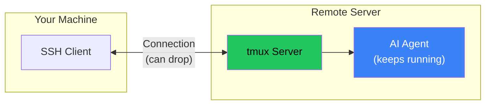

## The Problem: SSH Dies, Work Dies

You're running a long AI agent task on a remote server. The agent is deep into a complex refactoring job when your WiFi blips. SSH disconnects. The terminal closes.

All that context? Gone. The half-finished work? Orphaned processes, corrupted state.

The solution is older than AI agents: **tmux**.

## Why Tmux?



**Key insight**: tmux persists on the server, not the SSH connection. The agent keeps working even if you disconnect.

When SSH dies:
- Without tmux: Process receives SIGHUP, terminates
- With tmux: Process continues in detached session, you reattach later

## Quick Start

### Starting a Session

```bash
# SSH to remote server
ssh user@remote-server

# Start a new tmux session
tmux new-session -d -s ai-work

# Send commands to the session
tmux send-keys -t ai-work "cd /path/to/project && opencode" Enter

# Attach to watch it work
tmux attach -t ai-work
```

### If SSH Dies

```bash
# Reconnect via SSH
ssh user@remote-server

# Reattach to existing session
tmux attach -t ai-work
```

Your agent is still running, exactly where you left it.

## The Full Pattern

### 1. Create Detached Session

```bash
# Create session without attaching
tmux new-session -d -s moltbot-security

# Verify it exists
tmux list-sessions
```

### 2. Send Work to Session

```bash
# Navigate and start agent
tmux send-keys -t moltbot-security "cd ~/projects/moltbot" Enter
tmux send-keys -t moltbot-security "opencode" Enter

# Send the actual task
tmux send-keys -t moltbot-security "Implement Phase 1 security tasks from the continuation doc" Enter
```

### 3. Monitor Without Attaching

```bash
# Capture recent output (last 100 lines)
tmux capture-pane -t moltbot-security -p -S -100 | tail -50

# Check if session is still active
tmux list-sessions | grep moltbot-security
```

### 4. Attach When Needed

```bash
# Full interactive access
tmux attach -t moltbot-security

# Detach (leave running): Ctrl+B then D
```

## Recovery Commands Cheat Sheet

```bash
# List all sessions
tmux list-sessions

# Attach to specific session
tmux attach -t SESSION_NAME

# Attach to most recent session
tmux attach

# Detach from session (while attached)
# Press: Ctrl+B, then D

# Kill a session
tmux kill-session -t SESSION_NAME

# Kill all sessions
tmux kill-server

# Capture session output to file
tmux capture-pane -t SESSION_NAME -p -S -1000 > output.txt

# Send keys to detached session
tmux send-keys -t SESSION_NAME "command here" Enter

# Check if command is still running
tmux list-panes -t SESSION_NAME -F "#{pane_current_command}"
```

## Best Practices for AI Agent Sessions

### 1. Name Sessions Descriptively

```bash
# Bad
tmux new-session -d -s work

# Good
tmux new-session -d -s moltbot-security-phase1
```

### 2. Log Important Output

```bash
# Before starting long task
tmux pipe-pane -t ai-work -o 'cat >> ~/logs/ai-work.log'
```

### 3. Set Up Continuation Docs

Create a file the agent can reference if you need to restart:

```markdown
# continuation.md
## Current State
- Completed: Tasks 1-3
- In Progress: Task 4 (firewall rules)
- Next: Task 5 (audit logging)

## Commands Run
- Installed pf-anchor at /etc/pf.anchors/moltbot
- Modified /etc/pf.conf

## Resume Instructions
Continue from Task 4, firewall rule verification.
```

### 4. Use Multiple Windows

```bash
# Create session with multiple windows
tmux new-session -d -s ai-project
tmux new-window -t ai-project -n "agent"
tmux new-window -t ai-project -n "logs"
tmux new-window -t ai-project -n "shell"

# Send agent to first window
tmux send-keys -t ai-project:agent "opencode" Enter

# Tail logs in second window
tmux send-keys -t ai-project:logs "tail -f /var/log/app.log" Enter
```

## When Things Go Wrong

### Session Shows as Dead

```bash
# Check for zombie sessions
tmux list-sessions

# If session is unresponsive, kill it
tmux kill-session -t SESSION_NAME

# Check if agent process is still running
ps aux | grep opencode
```

### Can't Attach (Session Busy)

```bash
# Force detach other clients
tmux attach -t SESSION_NAME -d
```

### Lost Track of What's Running

```bash
# See all panes and their commands
tmux list-panes -a -F "#{session_name}:#{window_name} - #{pane_current_command}"
```

## Key Takeaways

1. **Always use tmux for remote AI work** - The few seconds of setup save hours of lost work
2. **Detach, don't close** - Ctrl+B, D keeps the session alive
3. **Name sessions well** - You'll have many; make them findable
4. **Log important sessions** - pipe-pane captures everything
5. **Keep continuation docs** - Even if tmux saves the session, context helps resumption

The combination of tmux persistence and good documentation means you can work on remote AI tasks with confidence. When (not if) your connection drops, you'll reconnect and continue exactly where you left off.

---

*This pattern saved countless hours during remote security implementations on a Mac Mini over Tailscale. Every SSH drop would have meant restarting from scratch without tmux.*
