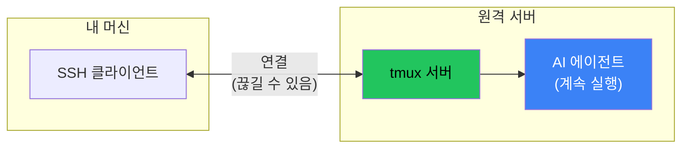

## 문제: SSH가 죽으면 작업도 죽는다

원격 서버에서 긴 AI 에이전트 태스크를 실행 중이다. 에이전트가 복잡한 리팩토링 작업 중간에 WiFi가 끊긴다. SSH 연결이 끊긴다. 터미널이 닫힌다.

그 모든 컨텍스트? 사라졌다. 반쯤 완성된 작업? 고아 프로세스, 손상된 상태.

해결책은 AI 에이전트보다 오래됐다: **tmux**.

## 왜 Tmux인가?



**핵심 통찰**: tmux는 SSH 연결이 아닌 서버에 지속된다. 연결이 끊겨도 에이전트는 계속 작업한다.

SSH가 죽을 때:
- tmux 없이: 프로세스가 SIGHUP을 받고 종료
- tmux 있으면: 프로세스가 분리된 세션에서 계속, 나중에 다시 연결

## 빠른 시작

### 세션 시작

```bash
# 원격 서버에 SSH
ssh user@remote-server

# 새 tmux 세션 시작
tmux new-session -d -s ai-work

# 세션에 명령 전송
tmux send-keys -t ai-work "cd /path/to/project && opencode" Enter

# 연결해서 작업 확인
tmux attach -t ai-work
```

### SSH가 죽으면

```bash
# SSH로 재연결
ssh user@remote-server

# 기존 세션에 다시 연결
tmux attach -t ai-work
```

에이전트가 떠난 곳 그대로 계속 실행 중이다.

## 전체 패턴

### 1. 분리된 세션 생성

```bash
# 연결하지 않고 세션 생성
tmux new-session -d -s moltbot-security

# 존재하는지 확인
tmux list-sessions
```

### 2. 세션에 작업 전송

```bash
# 이동하고 에이전트 시작
tmux send-keys -t moltbot-security "cd ~/projects/moltbot" Enter
tmux send-keys -t moltbot-security "opencode" Enter

# 실제 태스크 전송
tmux send-keys -t moltbot-security "continuation doc에서 Phase 1 보안 태스크 구현" Enter
```

### 3. 연결 없이 모니터링

```bash
# 최근 출력 캡처 (마지막 100줄)
tmux capture-pane -t moltbot-security -p -S -100 | tail -50

# 세션이 아직 활성인지 확인
tmux list-sessions | grep moltbot-security
```

### 4. 필요할 때 연결

```bash
# 전체 대화형 접근
tmux attach -t moltbot-security

# 분리 (실행 유지): Ctrl+B 후 D
```

## 복구 명령어 치트시트

```bash
# 모든 세션 나열
tmux list-sessions

# 특정 세션에 연결
tmux attach -t SESSION_NAME

# 가장 최근 세션에 연결
tmux attach

# 세션에서 분리 (연결 중일 때)
# 누르기: Ctrl+B, 그 다음 D

# 세션 종료
tmux kill-session -t SESSION_NAME

# 모든 세션 종료
tmux kill-server

# 세션 출력을 파일로 캡처
tmux capture-pane -t SESSION_NAME -p -S -1000 > output.txt

# 분리된 세션에 키 전송
tmux send-keys -t SESSION_NAME "command here" Enter

# 명령이 아직 실행 중인지 확인
tmux list-panes -t SESSION_NAME -F "#{pane_current_command}"
```

## AI 에이전트 세션 모범 사례

### 1. 세션 이름을 설명적으로

```bash
# 나쁨
tmux new-session -d -s work

# 좋음
tmux new-session -d -s moltbot-security-phase1
```

### 2. 중요한 출력 로깅

```bash
# 긴 태스크 시작 전
tmux pipe-pane -t ai-work -o 'cat >> ~/logs/ai-work.log'
```

### 3. 연속 문서 설정

재시작이 필요할 때 에이전트가 참조할 수 있는 파일 생성:

```markdown
# continuation.md
## 현재 상태
- 완료: 태스크 1-3
- 진행 중: 태스크 4 (방화벽 규칙)
- 다음: 태스크 5 (감사 로깅)

## 실행한 명령
- /etc/pf.anchors/moltbot에 pf-anchor 설치
- /etc/pf.conf 수정

## 재개 지침
태스크 4, 방화벽 규칙 검증부터 계속.
```

### 4. 여러 윈도우 사용

```bash
# 여러 윈도우로 세션 생성
tmux new-session -d -s ai-project
tmux new-window -t ai-project -n "agent"
tmux new-window -t ai-project -n "logs"
tmux new-window -t ai-project -n "shell"

# 첫 번째 윈도우에 에이전트 전송
tmux send-keys -t ai-project:agent "opencode" Enter

# 두 번째 윈도우에서 로그 tail
tmux send-keys -t ai-project:logs "tail -f /var/log/app.log" Enter
```

## 문제 발생 시

### 세션이 죽은 것으로 표시

```bash
# 좀비 세션 확인
tmux list-sessions

# 세션이 응답하지 않으면 종료
tmux kill-session -t SESSION_NAME

# 에이전트 프로세스가 아직 실행 중인지 확인
ps aux | grep opencode
```

### 연결 불가 (세션 사용 중)

```bash
# 다른 클라이언트 강제 분리
tmux attach -t SESSION_NAME -d
```

### 무엇이 실행 중인지 추적 못함

```bash
# 모든 패널과 명령 보기
tmux list-panes -a -F "#{session_name}:#{window_name} - #{pane_current_command}"
```

## 핵심 정리

1. **원격 AI 작업에 항상 tmux 사용** - 몇 초의 설정이 몇 시간의 잃어버린 작업을 절약
2. **닫지 말고 분리** - Ctrl+B, D가 세션을 살려둔다
3. **세션 이름을 잘 짓기** - 많아질 것이다; 찾을 수 있게 만들어라
4. **중요한 세션 로깅** - pipe-pane이 모든 것을 캡처
5. **연속 문서 유지** - tmux가 세션을 저장해도 컨텍스트가 재개를 돕는다

tmux 지속성과 좋은 문서화의 조합은 원격 AI 태스크를 자신감 있게 작업할 수 있게 한다. 연결이 끊기면 (만약이 아니라 언제), 재연결해서 떠난 곳 그대로 계속할 것이다.

---

*이 패턴은 Tailscale을 통해 Mac Mini에서 원격 보안 구현 중 수많은 시간을 절약했다. tmux 없이는 모든 SSH 끊김이 처음부터 재시작을 의미했을 것이다.*
