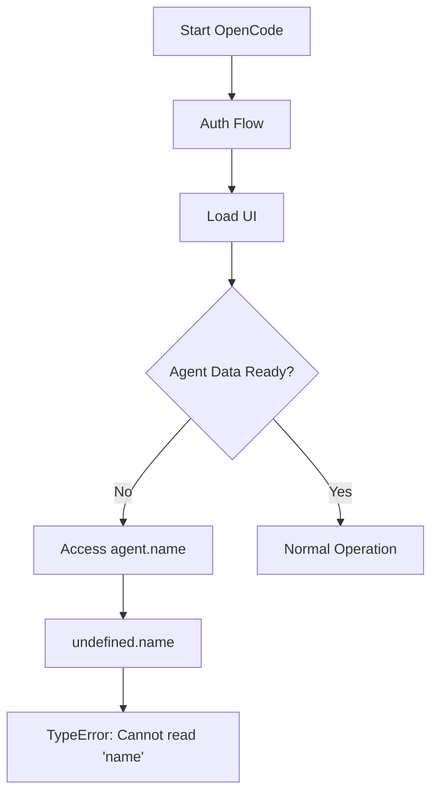
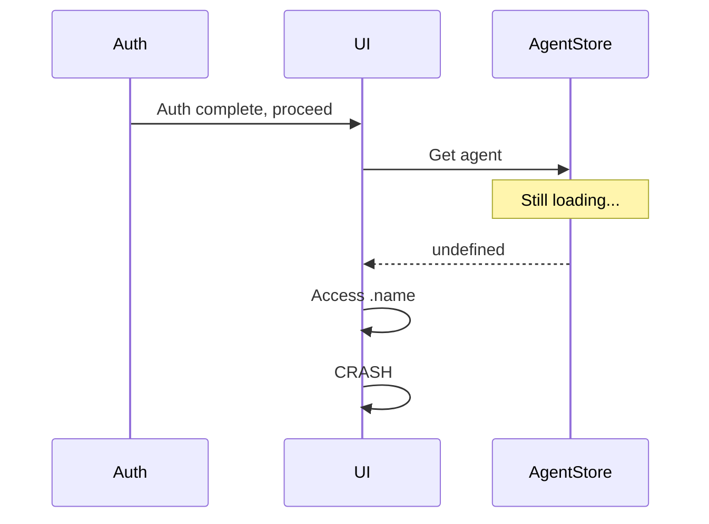
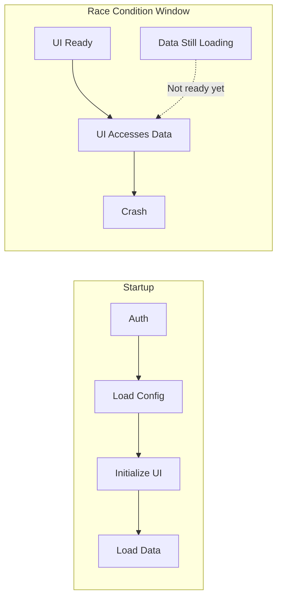

## The Problem

OpenCode CLI crashed with:

```
TypeError: Cannot read properties of undefined (reading 'name')
    at createUserMessage (src/session/prompt.ts:838)
    at ... (internal frames)
```

The error pointed at the tool's internal code, not user code. No configuration change triggered it. It just started happening.



## The Investigation

### Step 1: Locate the Error

The stack trace pointed to `src/session/prompt.ts:838` in the `createUserMessage()` function. This wasn't my code - it was deep inside the tool.

### Step 2: Understand the Pattern

```typescript
// What the code expected
const agentName = agent.name;  // agent should be an object

// What actually happened
const agentName = undefined.name;  // agent was undefined
```

The `Agent.get()` function returned `undefined` when the agent lookup failed, but there was no null check before accessing `.name`.

### Step 3: Find the Root Cause

This was a **race condition**:

1. Auth flow completes
2. UI layer initializes
3. UI tries to access `agent.name`
4. But agent data hasn't loaded yet
5. Crash



### Step 4: Search for Existing Issues

Searched the GitHub repo and found multiple duplicates:
- Issue #7550 (original report)
- Issue #7918 (duplicate)
- Issue #11110 (duplicate)

Maintainers couldn't reproduce. Comments mentioned "environment-specific."

**Environment-specific + internal error = race condition**. The timing varies by machine speed, network latency, and system load.

## The Resolution

Found a workaround in Issue #7550:

```bash
# 1. Close OpenCode completely

# 2. Open a new terminal window

# 3. Re-authenticate from CLI (bypasses TUI race condition)
opencode auth logout
opencode auth login

# 4. Start OpenCode again
opencode
```

The CLI auth flow completes fully before any UI initialization, avoiding the race.

## Why This Pattern Exists

Many tools have this structure:



The UI is "ready" before the data it needs. On fast machines or cached auth, this window is milliseconds. On slow networks or cold starts, it's noticeable - and crashable.

## Debugging Third-Party Tool Crashes

### 1. Identify Whose Code Is Crashing

```
YOUR code:      /Users/you/project/src/...
TOOL code:      node_modules/tool/src/...
TOOL code:      ~/.local/share/tool/...
TOOL code:      /opt/homebrew/Cellar/tool/...
```

If the stack trace shows tool paths, it's not your bug to fix directly.

### 2. Search Before Filing

```bash
# GitHub search syntax
repo:org/tool TypeError agent undefined
repo:org/tool Cannot read properties
```

Most "random" crashes have been reported. Find duplicates for workarounds.

### 3. Look for Race Condition Patterns

| Signal | Likely Cause |
|--------|--------------|
| "Can't reproduce" | Timing-dependent |
| "Works sometimes" | Race condition |
| "Started after update" | Initialization order changed |
| "Only on slow networks" | Async loading race |

### 4. Try the Bypass

If auth/startup is involved:
- Re-authenticate from CLI
- Clear cache/state
- Use headless/non-TUI mode if available
- Slow down (add delays) if desperate

## When to File vs. Comment

| Situation | Action |
|-----------|--------|
| No existing issue | File with full details |
| Existing issue, same error | Comment with your environment |
| Existing issue, has workaround | Use workaround, thumbs-up issue |
| Duplicate issue | Close and link to original |

## Key Takeaways

1. **Stack traces don't lie about location** - But they can mislead about whose problem it is
2. **Environment-specific = race condition** - Different timing, different results
3. **Search issues first** - Workarounds often exist
4. **Auth/startup flows are fragile** - Lots of async operations competing
5. **CLI bypass** - When TUI crashes, CLI commands often still work

The bug isn't yours. The fix isn't yours either. But working around it? That's entirely your problem.
