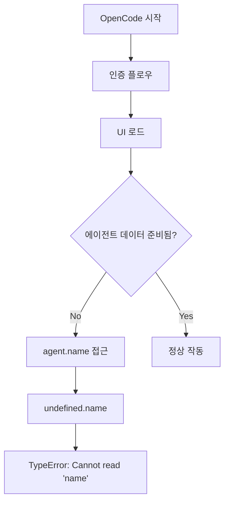
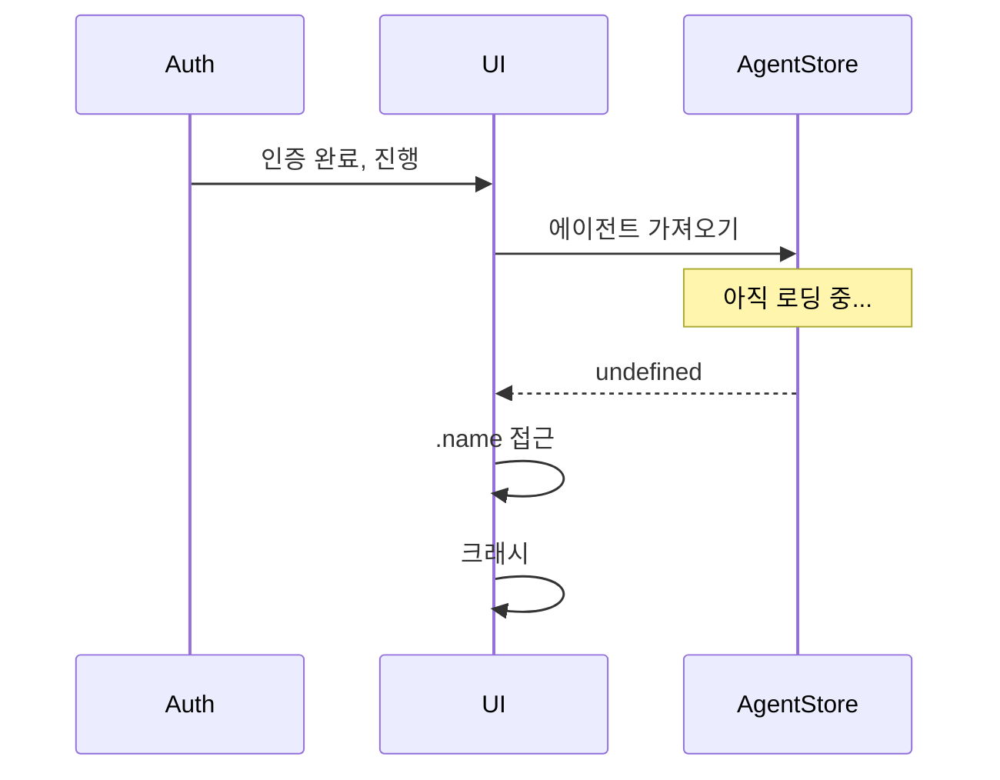
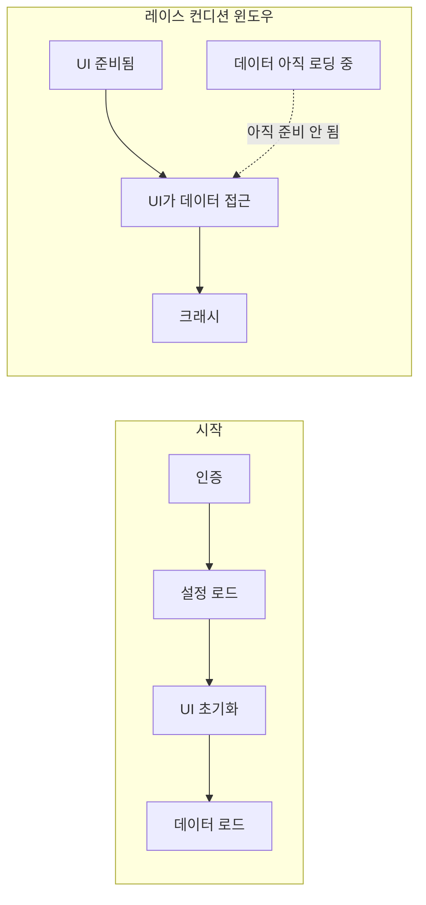

## 문제 상황

OpenCode CLI가 크래시했다:

```
TypeError: Cannot read properties of undefined (reading 'name')
    at createUserMessage (src/session/prompt.ts:838)
    at ... (internal frames)
```

에러가 사용자 코드가 아닌 도구의 내부 코드를 가리켰다. 설정 변경이 트리거한 것도 아니다. 그냥 갑자기 발생하기 시작했다.



## 조사 과정

### 1단계: 에러 위치 확인

스택 트레이스가 `createUserMessage()` 함수의 `src/session/prompt.ts:838`을 가리켰다. 내 코드가 아니었다 - 도구 내부 깊숙이 있는 코드였다.

### 2단계: 패턴 이해

```typescript
// 코드가 기대한 것
const agentName = agent.name;  // agent는 객체여야 함

// 실제 일어난 것
const agentName = undefined.name;  // agent가 undefined였음
```

`Agent.get()` 함수가 에이전트 조회 실패 시 `undefined`를 반환했지만, `.name` 접근 전에 null 체크가 없었다.

### 3단계: 근본 원인 파악

이것은 **레이스 컨디션**이었다:

1. 인증 플로우 완료
2. UI 레이어 초기화
3. UI가 `agent.name` 접근 시도
4. 하지만 에이전트 데이터가 아직 로드되지 않음
5. 크래시



### 4단계: 기존 이슈 검색

GitHub 레포를 검색해서 여러 중복을 발견했다:
- Issue #7550 (원본 보고)
- Issue #7918 (중복)
- Issue #11110 (중복)

메인테이너들이 재현할 수 없었다. 댓글에 "환경 특이적"이라고 언급되어 있었다.

**환경 특이적 + 내부 에러 = 레이스 컨디션**. 타이밍이 머신 속도, 네트워크 지연, 시스템 부하에 따라 달라진다.

## 해결 방법

Issue #7550에서 우회 방법을 발견:

```bash
# 1. OpenCode 완전히 종료

# 2. 새 터미널 창 열기

# 3. CLI에서 재인증 (TUI 레이스 컨디션 우회)
opencode auth logout
opencode auth login

# 4. OpenCode 다시 시작
opencode
```

CLI 인증 플로우가 UI 초기화 전에 완전히 완료되어 레이스를 피한다.

## 이 패턴이 존재하는 이유

많은 도구가 이런 구조를 가진다:



UI가 필요한 데이터보다 먼저 "준비"된다. 빠른 머신이나 캐시된 인증에서는 이 윈도우가 밀리초다. 느린 네트워크나 콜드 스타트에서는 눈에 띄고 - 크래시할 수 있다.

## 서드파티 도구 크래시 디버깅

### 1. 누구 코드가 크래시하는지 확인

```
내 코드:        /Users/you/project/src/...
도구 코드:      node_modules/tool/src/...
도구 코드:      ~/.local/share/tool/...
도구 코드:      /opt/homebrew/Cellar/tool/...
```

스택 트레이스가 도구 경로를 보여주면, 직접 고칠 버그가 아니다.

### 2. 신고 전에 검색

```bash
# GitHub 검색 구문
repo:org/tool TypeError agent undefined
repo:org/tool Cannot read properties
```

대부분의 "랜덤" 크래시는 이미 보고되어 있다. 우회 방법을 위해 중복을 찾아라.

### 3. 레이스 컨디션 패턴 찾기

| 신호 | 가능한 원인 |
|------|------------|
| "재현 불가" | 타이밍 의존적 |
| "가끔 작동" | 레이스 컨디션 |
| "업데이트 후 시작" | 초기화 순서 변경 |
| "느린 네트워크에서만" | 비동기 로딩 레이스 |

### 4. 우회 시도

인증/시작이 관련되어 있다면:
- CLI에서 재인증
- 캐시/상태 삭제
- 가능하면 headless/비-TUI 모드 사용
- 절박하면 느리게 (딜레이 추가)

## 신고 vs 댓글 판단

| 상황 | 행동 |
|------|------|
| 기존 이슈 없음 | 전체 세부사항과 함께 신고 |
| 기존 이슈, 같은 에러 | 환경 정보와 함께 댓글 |
| 기존 이슈, 우회 방법 있음 | 우회 방법 사용, 이슈에 엄지척 |
| 중복 이슈 | 닫고 원본에 링크 |

## 핵심 교훈

1. **스택 트레이스는 위치에 대해 거짓말하지 않는다** - 하지만 누구 문제인지에 대해 오도할 수 있다
2. **환경 특이적 = 레이스 컨디션** - 다른 타이밍, 다른 결과
3. **먼저 이슈 검색** - 우회 방법이 종종 존재한다
4. **인증/시작 플로우는 취약하다** - 많은 비동기 작업이 경쟁한다
5. **CLI 우회** - TUI가 크래시할 때, CLI 명령은 종종 여전히 작동한다

버그는 내 것이 아니다. 수정도 내 것이 아니다. 하지만 우회하는 것? 그건 전적으로 내 문제다.
