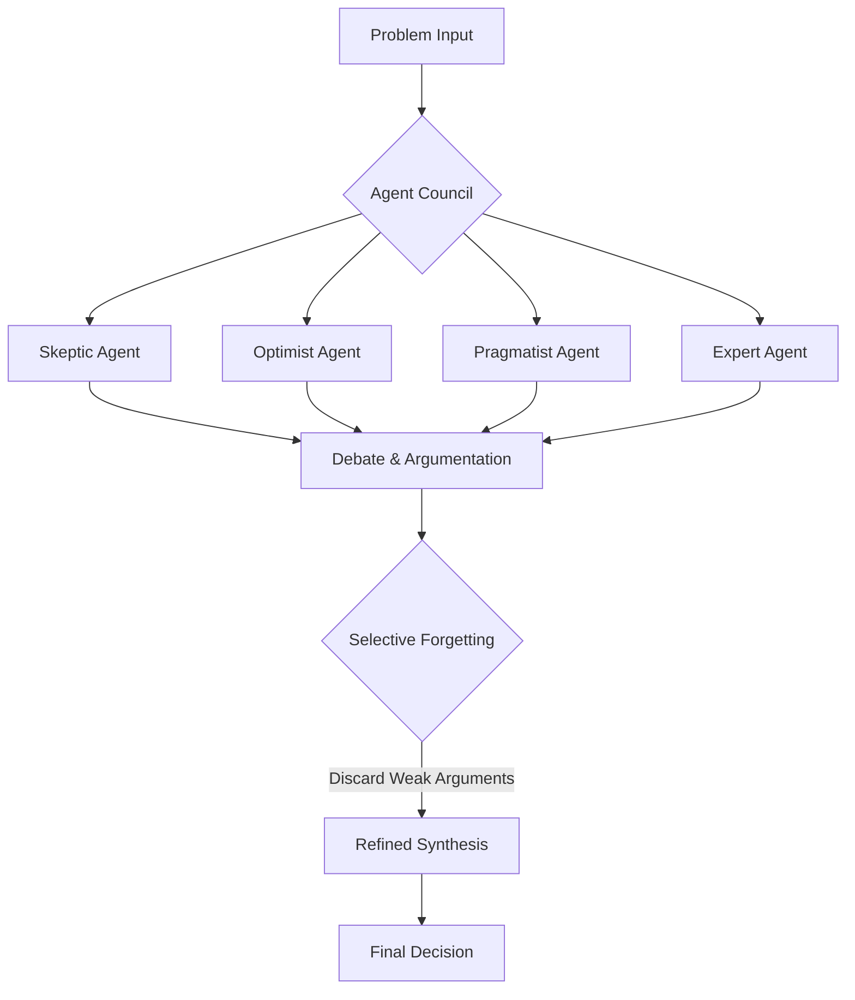

# Agent Council: Taste Through Forgetting

In the rapidly evolving landscape of Artificial Intelligence, we often find ourselves leaning on a single, powerful model to solve complex problems. However, as these problems grow in nuance and scale, the limitations of a monolithic approach become apparent. This is where the concept of an **Agent Council** comes into play—a multi-agent architecture that doesn't just aggregate opinions, but refines them through a process of selective "forgetting."

## Why: The Blind Spots of the Monolith

When we ask a single AI model to make a critical decision, we are essentially relying on a single "brain" with its own inherent biases, training data limitations, and potential for hallucination. Even the most advanced models can suffer from tunnel vision.

In human organizations, we solve this by forming committees or councils. We bring together people with different backgrounds, temperaments, and expertise. Why should our AI systems be any different?

A single agent might:
- Overlook a subtle security vulnerability.
- Be overly optimistic about a risky architectural change.
- Fail to consider the pragmatic constraints of a legacy system.

By introducing multiple agents with conflicting roles, we force a debate that surfaces these blind spots.

## How: The Council and the Art of Forgetting

The Agent Council architecture consists of several specialized agents, each with a distinct persona and objective:

1.  **The Skeptic**: Challenges every assumption and looks for potential failure points.
2.  **The Optimist**: Explores the "what if" and identifies opportunities for innovation.
3.  **The Pragmatist**: Grounds the discussion in reality, focusing on constraints and implementation details.
4.  **The Domain Expert**: Provides deep technical knowledge specific to the problem at hand.

### The Mechanism: Taste Through Forgetting

The most critical part of this architecture isn't the debate itself, but how the final decision is reached. We call this **"Taste Through Forgetting."**

Instead of trying to incorporate every single point made during the debate into a massive, bloated summary, the system is designed to let weak, contradictory, or irrelevant arguments fade away. The final synthesis is an emergent property of the debate where only the most robust and well-defended ideas survive.



## What: Implementing the Council

In practice, this can be implemented using a coordination layer that manages the conversation between agents. Below is a conceptual example of how a council might be invoked in a tool like `oh-my-moltbot`.

### Code Example: Council Orchestration

```typescript
interface AgentResponse {
  role: string;
  argument: string;
  strength: number; // 0 to 1
}

async function runAgentCouncil(problem: string): Promise<string> {
  const agents = [
    { name: 'Skeptic', prompt: 'Challenge everything...' },
    { name: 'Optimist', prompt: 'Find the potential...' },
    { name: 'Pragmatist', prompt: 'Keep it real...' }
  ];

  const debateHistory: AgentResponse[] = [];

  // Phase 1: Initial Arguments
  for (const agent of agents) {
    const response = await callAI(agent.prompt, problem);
    debateHistory.push(response);
  }

  // Phase 2: Cross-Examination
  // Agents review each other's arguments...

  // Phase 3: Selective Forgetting (The Synthesis)
  const finalSynthesis = await callAI(
    "Synthesize the following debate. Discard weak or contradictory points. " +
    "Focus only on the most robust conclusions that survived the critique.",
    JSON.stringify(debateHistory)
  );

  return finalSynthesis;
}
```

### Key Benefits

- **Robustness**: Decisions are battle-tested by multiple perspectives.
- **Nuance**: Captures the complexity of problems that a single agent might oversimplify.
- **Clarity**: The "forgetting" mechanism ensures the final output is concise and actionable, not a "wall of text" containing every minor thought.

## Conclusion

The future of AI isn't just bigger models; it's smarter orchestration. By embracing the Agent Council pattern and the philosophy of "Taste Through Forgetting," we can build systems that make more reliable, nuanced, and human-like decisions. Sometimes, the most important part of intelligence isn't what you remember, but what you choose to ignore.
