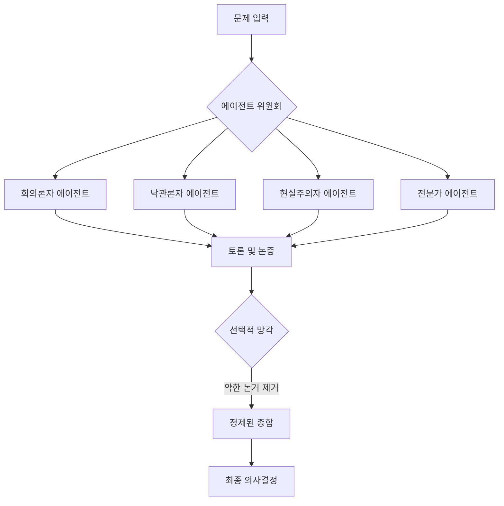

# 에이전트 위원회: 망각을 통한 통찰의 정제 (Taste Through Forgetting)

인공지능 기술이 급격히 발전하면서, 우리는 복잡한 문제를 해결하기 위해 단일 모델의 강력한 성능에 의존하곤 합니다. 하지만 문제의 복잡성과 규모가 커질수록, 거대 모델 하나에만 의존하는 방식의 한계가 드러나기 시작합니다. 이때 등장하는 개념이 바로 **에이전트 위원회(Agent Council)**입니다. 이는 단순히 여러 의견을 모으는 것을 넘어, '선택적 망각'이라는 과정을 통해 의견을 정제하는 멀티 에이전트 아키텍처입니다.

## Why: 단일 모델의 사각지대

복잡한 의사결정을 단일 AI 모델에게 맡기는 것은, 특정 편향이나 학습 데이터의 한계, 그리고 환각(hallucination) 가능성을 가진 하나의 '두뇌'에 전적으로 의존하는 것과 같습니다. 아무리 뛰어난 모델이라도 시야가 좁아지는 '터널 시야' 현상을 겪을 수 있습니다.

인간 사회에서는 이를 해결하기 위해 위원회를 구성합니다. 서로 다른 배경, 성향, 전문성을 가진 사람들을 모으죠. AI 시스템이라고 해서 다를 이유가 없습니다.

단일 에이전트는 다음과 같은 실수를 할 수 있습니다:
- 미세한 보안 취약점을 간과함.
- 위험한 아키텍처 변경에 대해 지나치게 낙관함.
- 기존 시스템의 현실적인 제약 사항을 고려하지 못함.

서로 상충하는 역할을 가진 여러 에이전트를 도입함으로써, 우리는 이러한 사각지대를 드러내는 '토론'을 강제할 수 있습니다.

## How: 위원회와 망각의 기술

에이전트 위원회 아키텍처는 각기 다른 페르소나와 목적을 가진 여러 전문 에이전트로 구성됩니다.

1.  **회의론자 (The Skeptic)**: 모든 가설에 의문을 제기하고 잠재적인 실패 지점을 찾습니다.
2.  **낙관론자 (The Optimist)**: "만약 ~라면?"을 탐구하며 혁신의 기회를 포착합니다.
3.  **현실주의자 (The Pragmatist)**: 제약 조건과 구현 세부 사항에 집중하여 논의를 현실에 안착시킵니다.
4.  **도메인 전문가 (The Domain Expert)**: 문제와 관련된 깊은 기술적 지식을 제공합니다.

### 핵심 기제: 망각을 통한 정제 (Taste Through Forgetting)

이 아키텍처의 가장 중요한 부분은 토론 그 자체가 아니라, 어떻게 최종 결정에 도달하느냐 하는 점입니다. 우리는 이를 **"망각을 통한 정제(Taste Through Forgetting)"**라고 부릅니다.

토론 중에 나온 모든 사소한 의견을 방대한 요약본에 다 담으려 하는 대신, 시스템은 약하거나 모순되거나 무관한 논거들을 자연스럽게 걸러내도록 설계됩니다. 최종 합의안은 토론의 결과물로서, 가장 견고하고 논리적으로 방어 가능한 아이디어들만이 살아남아 형성되는 창발적 속성입니다.



## What: 위원회 구현하기

실제로 이는 에이전트 간의 대화를 관리하는 조정 계층(Coordination Layer)을 통해 구현될 수 있습니다. 다음은 `oh-my-moltbot`과 같은 도구에서 위원회가 호출되는 방식을 개념적으로 보여주는 예시입니다.

### 코드 예시: 위원회 오케스트레이션

```typescript
interface AgentResponse {
  role: string;
  argument: string;
  strength: number; // 0 ~ 1
}

async function runAgentCouncil(problem: string): Promise<string> {
  const agents = [
    { name: 'Skeptic', prompt: '모든 것에 의문을 제기하세요...' },
    { name: 'Optimist', prompt: '잠재력을 찾으세요...' },
    { name: 'Pragmatist', prompt: '현실적으로 생각하세요...' }
  ];

  const debateHistory: AgentResponse[] = [];

  // 1단계: 초기 논거 제시
  for (const agent of agents) {
    const response = await callAI(agent.prompt, problem);
    debateHistory.push(response);
  }

  // 2단계: 상호 검증
  // 에이전트들이 서로의 논거를 검토합니다...

  // 3단계: 선택적 망각 (종합)
  const finalSynthesis = await callAI(
    "다음 토론을 종합하세요. 약하거나 모순되는 지점은 버리십시오. " +
    "비판을 견뎌내고 살아남은 가장 견고한 결론에만 집중하십시오.",
    JSON.stringify(debateHistory)
  );

  return finalSynthesis;
}
```

### 주요 이점

- **견고함**: 여러 관점에서 전투 테스트를 거친 의사결정이 가능합니다.
- **미묘한 차이 포착**: 단일 에이전트가 단순화할 수 있는 문제의 복잡성을 온전히 담아냅니다.
- **명확성**: '망각' 기제 덕분에 최종 결과물은 모든 사소한 생각을 담은 '텍스트의 벽'이 아니라, 간결하고 실행 가능한 형태가 됩니다.

## 결론

AI의 미래는 단순히 더 큰 모델을 만드는 것에 있지 않습니다. 더 똑똑한 오케스트레이션에 있습니다. 에이전트 위원회 패턴과 "망각을 통한 정제" 철학을 받아들임으로써, 우리는 더 신뢰할 수 있고 정교하며 인간에 가까운 의사결정 시스템을 구축할 수 있습니다. 때로는 지능의 가장 중요한 부분은 무엇을 기억하느냐가 아니라, 무엇을 무시하기로 선택하느냐에 있습니다.
