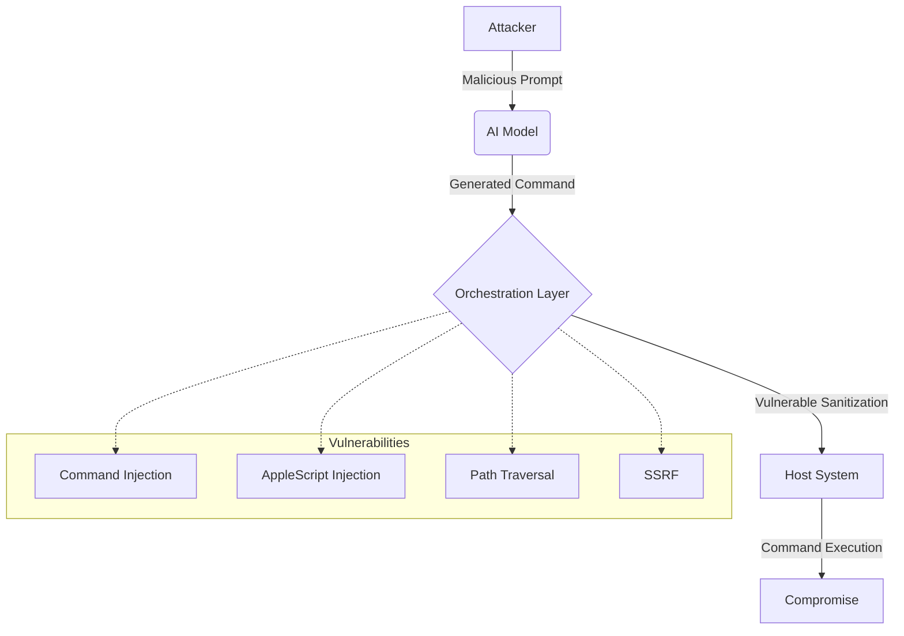

# 22 Ways Your AI Agent Can Be Compromised: A Security Audit

As we grant AI agents more autonomy—allowing them to read our files, execute commands, and interact with the web—we are inadvertently opening up a massive new attack surface. A recent comprehensive security audit of the **OpenClaw** automation framework revealed over 22 vulnerabilities, ranging from simple script injections to complex architectural flaws.

This post explores why AI security is often an afterthought and details the critical findings from the audit.

## Why: The High Stakes of AI Autonomy

AI agents are high-risk targets because they often operate with significant system permissions. If an agent can run a shell command or access a browser, a compromise of that agent is a compromise of the underlying system.

Unfortunately, "security-by-default" is rare in the current AI tooling gold rush. Developers are prioritizing functionality and speed over robust defense mechanisms. Many "security" implementations we've seen are merely superficial, relying on simple string matching that is easily bypassed.

## How: Auditing the OpenClaw Framework

The audit focused on the trust boundaries between the AI model, the orchestration layer, and the host system. We identified several critical and high-severity vulnerabilities.

### Critical Vulnerabilities (CVSS 9.0+)

1.  **Command Injection via `eval()`**: A backup script used `eval()` on user-provided filenames, allowing arbitrary command execution.
2.  **AppleScript Injection**: The sanitization logic only escaped double quotes, failing to account for AppleScript operators that can be used to break out of strings.
3.  **Path Traversal via Symlinks**: The system used `path.resolve()` to validate paths but didn't check if the path was a symlink pointing outside the allowed directory.
4.  **SSRF via DNS Rebinding**: Hostname validation happened before resolution, making the system vulnerable to DNS rebinding attacks where a malicious domain resolves to a local IP after validation.
5.  **Race Condition in Rate Limiting**: A classic TOCTOU (Time-of-check to time-of-use) vulnerability allowed bypassing rate limits by sending multiple requests simultaneously.
6.  **Shell Injection via Newlines**: Using `$()` with embedded newlines allowed bypassing simple regex-based command filters.

### Architectural Flaws

Beyond specific bugs, the audit revealed systemic issues:
-   **No Defense in Depth**: If one layer failed, the entire system was compromised.
-   **Permeable Trust Boundaries**: Agents could easily escalate privileges or access data they shouldn't have.
-   **Tamperable Audit Logs**: Logs were stored in world-writable directories, allowing an attacker to erase their tracks.



## What: Securing Your AI Automation

Securing AI agents requires a shift in mindset. We must treat AI-generated content as **untrusted input** at every stage.

### Security Checklist for AI Agents

- [ ] **Principle of Least Privilege**: Run agents in isolated environments (Docker, VMs) with minimal permissions.
- [ ] **Robust Sanitization**: Use well-tested libraries for sanitizing shell commands and scripts. Never rely on simple regex.
- [ ] **Input Validation**: Validate all inputs (including those from the AI) against a strict allow-list.
- [ ] **Secure Logging**: Store audit logs in a secure, append-only location that the agent cannot access.
- [ ] **Network Isolation**: Use firewalls to restrict the agent's network access to only necessary domains.
- [ ] **Human-in-the-loop**: For high-risk actions, require explicit human approval.

### Code Example: Secure Command Execution

Instead of using `eval` or string concatenation, use structured execution:

```typescript
import { spawn } from 'child_process';

// BAD: Vulnerable to injection
// exec(`ls ${userInput}`);

// GOOD: Arguments are passed separately
function secureExec(command: string, args: string[]) {
  const child = spawn(command, args, {
    shell: false, // Disable shell to prevent injection
    timeout: 5000,
    env: {} // Clear environment variables
  });
  
  // Handle output...
}
```

## Conclusion

The 22+ vulnerabilities found in this audit are a wake-up call. As we build the future of AI automation, security cannot be an optional feature. It must be baked into the architecture from day one. Audit your systems, isolate your agents, and never trust the output of a model blindly.
