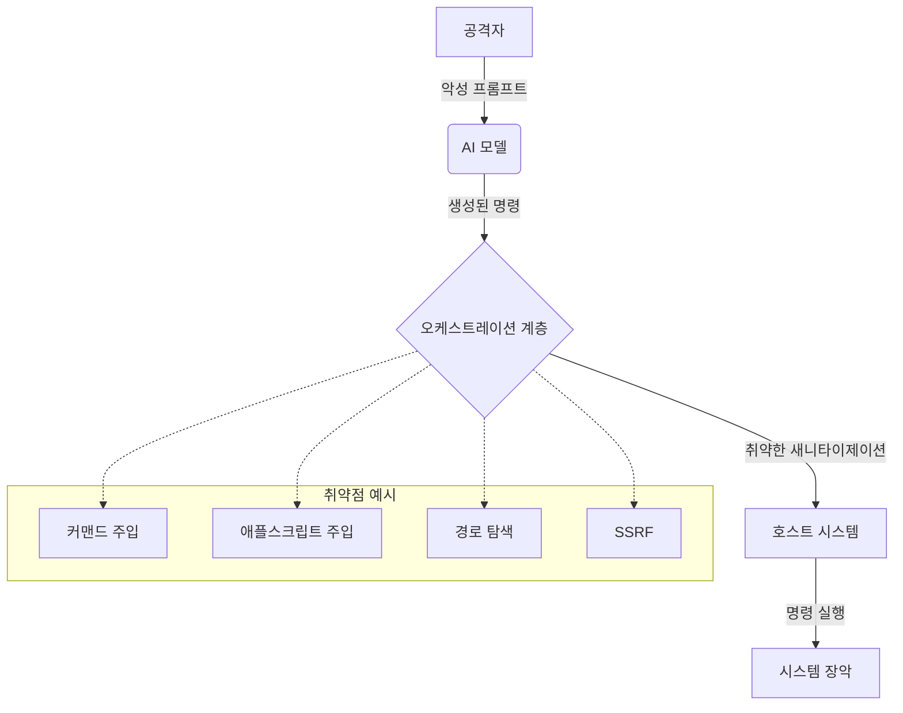

# AI 에이전트가 해킹당하는 22가지 방법: 보안 감사 보고서

우리가 AI 에이전트에게 더 많은 자율성을 부여할수록—파일을 읽고, 명령을 실행하고, 웹과 상호작용하게 할수록—우리는 의도치 않게 거대한 새로운 공격 표면(Attack Surface)을 열어주고 있습니다. 최근 진행된 **OpenClaw** 자동화 프레임워크에 대한 종합 보안 감사 결과, 단순한 스크립트 주입부터 복잡한 아키텍처 결함에 이르기까지 22개 이상의 취약점이 발견되었습니다.

이 글에서는 왜 AI 보안이 종종 뒷전으로 밀려나는지, 그리고 감사에서 발견된 핵심적인 취약점들은 무엇인지 자세히 살펴봅니다.

## Why: AI 자율성에 따르는 높은 위험

AI 에이전트는 시스템에 대한 상당한 권한을 가지고 작동하는 경우가 많기 때문에 매우 위험한 공격 대상입니다. 에이전트가 쉘 명령을 실행하거나 브라우저에 접근할 수 있다면, 해당 에이전트의 권한 탈취는 곧 기반 시스템 전체의 권한 탈취로 이어질 수 있습니다.

불행히도 현재의 AI 도구 개발 열풍 속에서 "기본 보안(Security-by-default)"은 찾아보기 힘듭니다. 개발자들은 견고한 방어 기제보다는 기능 구현과 속도를 우선시하고 있습니다. 우리가 목격한 많은 "보안" 구현체들은 단순히 문자열을 매칭하는 수준에 불과하며, 이는 공격자에 의해 너무나 쉽게 우회될 수 있습니다.

## How: OpenClaw 프레임워크 감사 결과

이번 감사는 AI 모델, 오케스트레이션 계층, 그리고 호스트 시스템 사이의 신뢰 경계(Trust Boundary)에 집중했습니다. 그 결과 여러 개의 치명적(Critical) 및 높은(High) 위험도의 취약점을 식별했습니다.

### 치명적 취약점 (CVSS 9.0+)

1.  **`eval()`을 통한 커맨드 주입**: 백업 스크립트가 사용자 제공 파일명에 `eval()`을 사용하여 임의의 명령 실행이 가능했습니다.
2.  **애플스크립트(AppleScript) 주입**: 새니타이제이션(Sanitization) 로직이 큰따옴표만 이스케이프하고, 문자열을 탈출하는 데 사용될 수 있는 애플스크립트 연산자들을 고려하지 않았습니다.
3.  **심볼릭 링크를 통한 경로 탐색(Path Traversal)**: `path.resolve()`를 사용하여 경로를 검증했지만, 해당 경로가 허용된 디렉토리 외부를 가리키는 심볼릭 링크인지 확인하지 않았습니다.
4.  **DNS 리바인딩을 통한 SSRF**: 호스트네임 검증이 IP 해소(Resolution) 전에 이루어져, 검증 후 로컬 IP로 해소되는 악성 도메인을 이용한 DNS 리바인딩 공격에 취약했습니다.
5.  **레이스 컨디션(Race Condition)**: 전형적인 TOCTOU(Time-of-check to time-of-use) 취약점으로 인해, 여러 요청을 동시에 보내 속도 제한(Rate Limit)을 우회할 수 있었습니다.
6.  **줄바꿈을 이용한 쉘 주입**: `$()` 내부에 줄바꿈 문자를 포함시켜 단순한 정규식 기반의 명령 필터를 우회할 수 있었습니다.

### 아키텍처 결함

개별 버그 외에도 시스템적인 문제들이 발견되었습니다:
-   **심층 방어(Defense in Depth) 부재**: 한 계층이 뚫리면 시스템 전체가 장악되는 구조였습니다.
-   **투과성 높은 신뢰 경계**: 에이전트가 권한을 상승시키거나 접근해서는 안 될 데이터에 쉽게 접근할 수 있었습니다.
-   **변조 가능한 감사 로그**: 로그가 누구나 쓸 수 있는 디렉토리에 저장되어 있어, 공격자가 자신의 흔적을 지울 수 있었습니다.



## What: AI 자동화 보안 강화하기

AI 에이전트 보안을 위해서는 사고의 전환이 필요합니다. 우리는 AI가 생성한 모든 콘텐츠를 모든 단계에서 **"신뢰할 수 없는 입력(Untrusted Input)"**으로 취급해야 합니다.

### AI 에이전트 보안 체크리스트

- [ ] **최소 권한 원칙**: 에이전트를 격리된 환경(Docker, VM)에서 최소한의 권한으로 실행하십시오.
- [ ] **견고한 새니타이제이션**: 쉘 명령이나 스크립트를 정화할 때 검증된 라이브러리를 사용하십시오. 단순 정규식에 의존하지 마십시오.
- [ ] **입력값 검증**: AI로부터 오는 입력을 포함한 모든 입력을 엄격한 화이트리스트 기반으로 검증하십시오.
- [ ] **안전한 로깅**: 감사 로그를 에이전트가 접근할 수 없는 안전한 추가 전용(Append-only) 위치에 저장하십시오.
- [ ] **네트워크 격리**: 방화벽을 사용하여 에이전트의 네트워크 접근을 필요한 도메인으로만 제한하십시오.
- [ ] **인간 개입(Human-in-the-loop)**: 위험도가 높은 작업에 대해서는 반드시 인간의 명시적인 승인을 거치도록 하십시오.

### 코드 예시: 안전한 명령 실행

`eval`이나 문자열 연결 대신 구조화된 실행 방식을 사용하십시오:

```typescript
import { spawn } from 'child_process';

// 나쁜 예: 주입 공격에 취약함
// exec(`ls ${userInput}`);

// 좋은 예: 인자를 별도로 전달함
function secureExec(command: string, args: string[]) {
  const child = spawn(command, args, {
    shell: false, // 주입 방지를 위해 쉘 비활성화
    timeout: 5000,
    env: {} // 환경 변수 초기화
  });
  
  // 출력 처리...
}
```

## 결론

이번 감사에서 발견된 22개 이상의 취약점은 우리에게 보내는 경고입니다. AI 자동화의 미래를 건설함에 있어 보안은 선택 사항이 될 수 없습니다. 아키텍처 설계 단계부터 보안이 내재되어야 합니다. 여러분의 시스템을 감사하고, 에이전트를 격리하며, 모델의 출력을 결코 맹신하지 마십시오.
