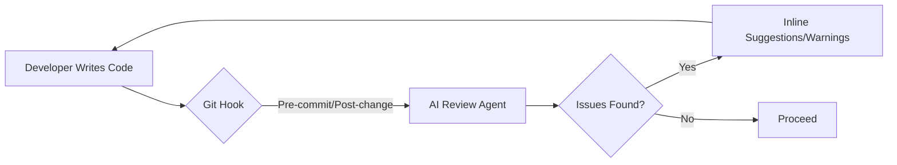

# Shift-Left with AI: Automatic Code Review via Hooks

Code review is one of the most critical yet time-consuming parts of the software development lifecycle. It's the final gatekeeper for quality, security, and maintainability. However, human reviewers are often a bottleneck, and fatigue can lead to missed bugs or inconsistent feedback.

What if you could get an instant, high-quality code review before you even push your code? By leveraging AI models optimized for code analysis and integrating them into your workflow via hooks, you can "shift-left" your quality assurance and catch issues earlier than ever.

## Why: The Bottleneck of Human Review

In many teams, code review is where momentum goes to die. A developer finishes a feature, opens a PR, and then waits hours or even days for a colleague to find the time to review it.

Human reviewers face several challenges:
-   **Fatigue**: Reviewing hundreds of lines of code is mentally taxing.
-   **Inconsistency**: Different reviewers focus on different things.
-   **Context Switching**: Interrupting a developer's flow to perform a review is costly.

AI-powered code review addresses these issues by providing:
-   **Instant Feedback**: Get results in seconds, not days.
-   **Consistency**: The AI applies the same standards every time.
-   **Scalability**: AI doesn't get tired and can review any number of changes simultaneously.

## How: The `kimi-auto-review` Hook

In the `oh-my-opencode` ecosystem, we've implemented the `kimi-auto-review` hook. This hook is designed to be non-blocking and contextual, triggering at key points in the development flow.

### Trigger Points

1.  **Post-Significant Change**: After a large number of lines are modified, the AI performs a background scan.
2.  **Pre-Commit**: A final check to ensure no obvious bugs or security flaws are being committed.
3.  **PR Creation**: A comprehensive review that serves as a first pass for human reviewers.

### The Model: Kimi K2

We use models like **Kimi K2**, which are specifically tuned for code understanding and reasoning. These models are capable of:
-   Identifying potential logic bugs.
-   Suggesting performance optimizations.
-   Checking for security vulnerabilities (e.g., hardcoded secrets, injection vectors).
-   Verifying adherence to project-specific style guides.



## What: Implementation and Results

The implementation involves a simple script that gathers the diff of the changes and sends it to the AI model with a specialized system prompt.

### Example: AI Review Comment

Imagine you accidentally left a debug log with sensitive information:

```typescript
// Before AI Review
function processPayment(details: any) {
  console.log("Processing payment for:", details); // DEBUG: Remove before prod
  // ... logic
}
```

**AI Review Output:**
> ⚠️ **Security Warning**: Potential sensitive data exposure in `console.log`. The `details` object may contain PII or payment tokens. Remove this log before committing.

### Benefits of Automated Review

-   **Reduced Lead Time**: PRs are approved faster because the "easy" stuff is already caught.
-   **Higher Quality**: Fewer bugs reach production.
-   **Educational**: Junior developers receive instant feedback on best practices.
-   **Focused Humans**: Human reviewers can focus on high-level architecture and business logic rather than syntax or obvious bugs.

## Conclusion

Automatic AI code review isn't about replacing humans; it's about empowering them. By automating the tedious and error-prone parts of the review process, we can move faster and build more robust software. If you're not already using AI to review your code, it's time to hook it up.
