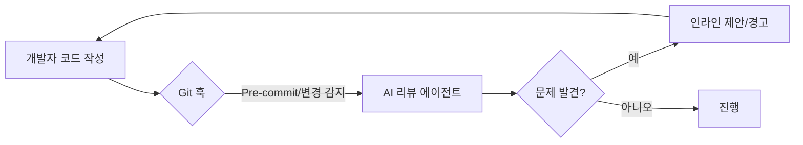

# AI와 함께하는 Shift-Left: 훅(Hook)을 이용한 자동 코드 리뷰

코드 리뷰는 소프트웨어 개발 생명주기에서 가장 중요하면서도 많은 시간이 소요되는 작업 중 하나입니다. 품질, 보안, 유지보수성을 보장하는 최후의 보루와 같죠. 하지만 사람에 의한 리뷰는 종종 병목 현상을 일으키며, 피로도로 인해 버그를 놓치거나 일관성 없는 피드백을 줄 때가 많습니다.

코드를 푸시하기도 전에 즉각적이고 수준 높은 코드 리뷰를 받을 수 있다면 어떨까요? 코드 분석에 최적화된 AI 모델을 활용하고 이를 Git 훅(Hook)을 통해 워크플로우에 통합하면, 품질 보증 단계를 개발 초기 단계로 끌어오는 "Shift-Left"를 실현하고 문제를 그 어느 때보다 빠르게 발견할 수 있습니다.

## Why: 인간 리뷰어의 한계와 병목 현상

많은 팀에서 코드 리뷰는 개발 속도가 급격히 떨어지는 지점입니다. 개발자가 기능을 완성하고 PR(Pull Request)을 올려도, 동료가 리뷰할 시간을 낼 때까지 몇 시간, 길게는 며칠을 기다려야 합니다.

인간 리뷰어는 다음과 같은 어려움에 직면합니다:
-   **피로도**: 수백 줄의 코드를 꼼꼼히 검토하는 것은 정신적으로 매우 고된 일입니다.
-   **일관성 부족**: 리뷰어마다 집중하는 포인트가 다를 수 있습니다.
-   **문맥 전환 비용**: 리뷰를 위해 자신의 개발 흐름을 끊어야 하는 비용이 큽니다.

AI 기반 코드 리뷰는 다음과 같은 장점을 통해 이러한 문제를 해결합니다:
-   **즉각적인 피드백**: 며칠이 아닌 몇 초 만에 결과를 얻을 수 있습니다.
-   **일관성**: AI는 항상 동일한 기준을 적용합니다.
-   **확장성**: AI는 지치지 않으며 동시에 수많은 변경 사항을 리뷰할 수 있습니다.

## How: `kimi-auto-review` 훅

`oh-my-opencode` 생태계에서는 `kimi-auto-review` 훅을 구현하여 사용하고 있습니다. 이 훅은 개발 흐름을 방해하지 않으면서도(non-blocking) 맥락에 맞게 작동하도록 설계되었습니다.

### 트리거 시점

1.  **유의미한 변경 후**: 일정 수 이상의 코드 라인이 수정되면 AI가 백그라운드 스캔을 수행합니다.
2.  **커밋 전 (Pre-commit)**: 명백한 버그나 보안 결함이 커밋되지 않도록 최종 점검합니다.
3.  **PR 생성 시**: 인간 리뷰어가 검토하기 전, 첫 번째 패스(pass)로서 종합적인 리뷰를 수행합니다.

### 사용 모델: Kimi K2

우리는 코드 이해와 추론에 특화된 **Kimi K2**와 같은 모델을 사용합니다. 이 모델들은 다음과 같은 능력을 갖추고 있습니다:
-   잠재적인 로직 버그 식별.
-   성능 최적화 제안.
-   보안 취약점 점검 (예: 하드코딩된 비밀번호, 주입 공격 벡터).
-   프로젝트별 스타일 가이드 준수 여부 확인.



## What: 구현과 효과

구현은 변경된 코드의 차이점(diff)을 수집하여 코드 리뷰 전용 시스템 프롬프트와 함께 AI 모델에 전달하는 간단한 스크립트로 이루어집니다.

### 예시: AI 리뷰 코멘트

실수로 민감한 정보가 포함된 디버그 로그를 남겼다고 가정해 봅시다:

```typescript
// 리뷰 전
function processPayment(details: any) {
  console.log("결제 처리 중:", details); // 디버그: 배포 전 삭제 필요
  // ... 로직
}
```

**AI 리뷰 출력:**
> ⚠️ **보안 경고**: `console.log`에서 민감한 데이터 노출 위험이 있습니다. `details` 객체에는 개인정보나 결제 토큰이 포함될 수 있습니다. 커밋하기 전에 이 로그를 제거하십시오.

### 자동화된 리뷰의 이점

-   **리드 타임 단축**: 사소한 문제들이 미리 해결되므로 PR 승인이 빨라집니다.
-   **품질 향상**: 더 적은 버그가 운영 환경에 도달합니다.
-   **교육적 효과**: 주니어 개발자들은 베스트 프랙티스에 대한 즉각적인 피드백을 받을 수 있습니다.
-   **인간의 집중력 보존**: 인간 리뷰어는 구문 오류나 뻔한 버그 대신 고수준의 아키텍처와 비즈니스 로직에 집중할 수 있습니다.

## 결론

자동화된 AI 코드 리뷰는 인간을 대체하기 위한 것이 아니라, 인간에게 힘을 실어주기 위한 것입니다. 리뷰 과정의 지루하고 실수하기 쉬운 부분들을 자동화함으로써, 우리는 더 빠르게 움직이고 더 견고한 소프트웨어를 만들 수 있습니다. 아직 AI를 코드 리뷰에 활용하고 있지 않다면, 지금 바로 훅을 연결해 보세요.
