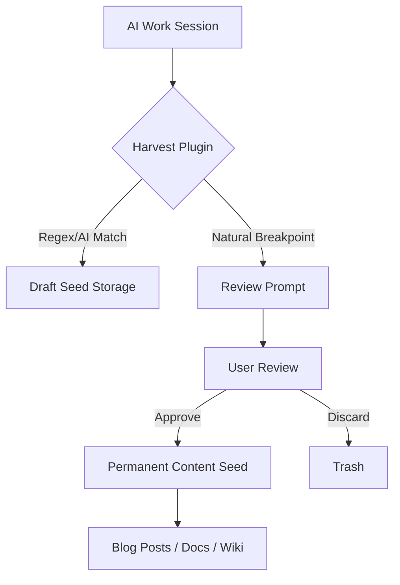

# Never Lose an Insight Again: Auto-Harvesting AI Sessions

We've all been there: you're deep in a session with an AI, debugging a complex issue or brainstorming a new feature. Suddenly, you hit a "Eureka!" moment. You discover a clever pattern, a non-obvious root cause, or a brilliant way to structure your code. You feel like a genius.

But then the session ends. You move on to the next task. And that brilliant insight? It's buried in a chat log you'll likely never read again. It's ephemeral knowledge—valuable in the moment, but lost to the future.

To solve this, we need a way to automatically detect and enforce the **harvesting** of these insights, turning them into permanent "content seeds" that can grow into blog posts, documentation, or architectural guidelines.

## Why: The Tragedy of Ephemeral Insights

Knowledge compounds. The more insights you capture today, the easier it is to solve problems tomorrow. However, manual harvesting is friction-heavy. When you're in the flow, the last thing you want to do is stop and manually copy-paste an idea into a separate notes file.

The tragedy of ephemeral sessions is that:
-   **Insights are forgotten**: Even the best ideas fade within hours.
-   **Patterns are missed**: You might discover the same "trick" three times before realizing it's a reusable pattern.
-   **Content creation is hard**: Starting a blog post from a blank page is daunting. Starting from a "seed" captured during a real work session is easy.

## How: The Auto-Harvesting Plugin

The solution is to build harvest awareness directly into the AI orchestration layer. We've developed a plugin for `oh-my-opencode` that automates this process through five key mechanisms:

### 1. Continuous Detection
The plugin monitors the conversation in real-time, looking for "seed-worthy" patterns. It uses a combination of regex matching and AI-based classification to identify:
-   **Realizations**: "I realized that...", "The trick is..."
-   **Root Causes**: "The bug was actually caused by...", "The fix was..."
-   **Effective Prompts**: Patterns that yielded particularly good results.

### 2. Draft Storage
Detected potential seeds aren't immediately saved to disk. Instead, they are kept in memory as "drafts." This prevents the knowledge base from being cluttered with low-quality noise.

### 3. Periodic Prompts
To minimize friction, the plugin reminds the user to review drafts at natural breakpoints—after a certain number of messages, after a time interval, or when the draft count reaches a threshold.

### 4. Review Tools
We provide a suite of commands to manage the harvest:
-   `harvest-review`: Step through drafts and decide which to keep.
-   `harvest-approve-all`: Quickly save all detected seeds.
-   `harvest-status`: See how many insights are currently "in the field."

### 5. System Prompt Injection
Finally, we inject "harvest awareness" into the AI's system prompt. The AI itself becomes an active participant in the harvesting process, suggesting when a particular point might be worth saving as a seed.



## What: From Seeds to Knowledge

By enforcing this workflow, we transform the nature of AI work. A session is no longer just a means to an end (fixing a bug); it's a **content generation event**.

### Case Study: 14 Seeds to 29 Posts
In a recent experiment, we enabled auto-harvesting for a week of development. The system detected 42 potential insights. After a quick review, 14 were approved as high-quality seeds. Those 14 seeds eventually became the foundation for 29 distinct blog posts and documentation updates.

### Code Example: Detection Logic

```typescript
const SEED_PATTERNS = [
  /I realized that/i,
  /The trick is/i,
  /Interesting pattern/i,
  /Root cause was/i
];

function detectPotentialSeed(message: string): boolean {
  return SEED_PATTERNS.some(pattern => pattern.test(message));
}
```

## Conclusion

Your AI sessions are a gold mine of insights. Don't let them vanish into the ether. By implementing auto-harvesting, you ensure that every "Eureka!" moment is captured, refined, and preserved. Turn your ephemeral work into permanent knowledge, one seed at a time.
