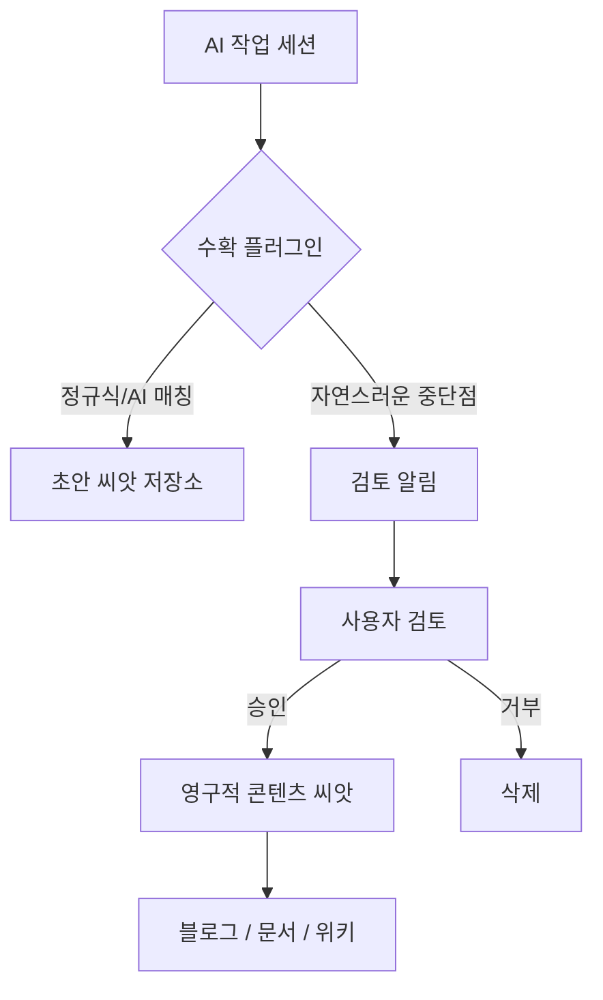

# 통찰을 놓치지 않는 법: AI 세션 자동 수확(Auto-Harvesting)

누구나 한 번쯤 겪어본 일입니다. AI와 함께 복잡한 문제를 디버깅하거나 새로운 기능을 구상하며 깊은 몰입 상태에 빠져 있을 때, 갑자기 "유레카!" 하는 순간이 찾아옵니다. 기발한 패턴, 생각지도 못한 근본 원인, 혹은 코드를 구조화하는 멋진 방법을 발견하죠. 그 순간만큼은 스스로가 천재처럼 느껴집니다.

하지만 세션이 끝나고 다음 작업으로 넘어가면 어떻게 될까요? 그 빛나는 통찰은 다시는 읽지 않을 채팅 로그 어딘가에 묻혀버립니다. 그것은 '휘발성 지식'입니다. 그 순간에는 가치 있었지만, 미래의 나에게는 전달되지 못하고 사라지는 것이죠.

이를 해결하기 위해, 우리는 이러한 통찰을 자동으로 감지하고 **수확(Harvesting)**하는 시스템이 필요합니다. 휘발성 아이디어를 블로그 포스트, 문서, 혹은 아키텍처 가이드라인으로 성장할 수 있는 영구적인 "콘텐츠 씨앗(Content Seeds)"으로 만드는 것입니다.

## Why: 휘발성 통찰의 비극

지식은 복리(Compound)로 쌓입니다. 오늘 더 많은 통찰을 기록할수록 내일의 문제를 해결하기가 더 쉬워집니다. 하지만 수동으로 기록하는 것은 번거롭습니다. 작업의 흐름(Flow) 속에 있을 때, 흐름을 끊고 아이디어를 별도의 노트 파일에 복사해서 붙여넣고 싶은 사람은 아무도 없습니다.

휘발성 세션의 비극은 다음과 같습니다:
-   **통찰은 잊혀집니다**: 아무리 좋은 아이디어라도 몇 시간만 지나면 희미해집니다.
-   **패턴을 놓칩니다**: 똑같은 '요령'을 세 번이나 발견하고서야 그것이 재사용 가능한 패턴임을 깨닫게 될 수도 있습니다.
-   **콘텐츠 제작이 어렵습니다**: 빈 페이지에서 블로그 글을 시작하는 것은 막막합니다. 하지만 실제 작업 세션에서 수확한 '씨앗'에서 시작하면 훨씬 쉽습니다.

## How: 자동 수확(Auto-Harvesting) 플러그인

해결책은 AI 오케스트레이션 계층에 '수확 인지 능력'을 직접 심는 것입니다. 우리는 `oh-my-opencode`를 위해 다섯 가지 핵심 기제를 통해 이 과정을 자동화하는 플러그인을 개발했습니다.

### 1. 지속적 감지 (Continuous Detection)
플러그인은 대화를 실시간으로 모니터링하며 "씨앗이 될 만한" 패턴을 찾습니다. 정규식 매칭과 AI 기반 분류를 결합하여 다음과 같은 내용을 식별합니다:
-   **깨달음**: "~라는 것을 깨달았습니다", "요령은 ~입니다"
-   **근본 원인**: "버그의 실제 원인은 ~였습니다", "해결책은 ~였습니다"
-   **효과적인 프롬프트**: 특히 좋은 결과를 냈던 프롬프트 패턴.

### 2. 초안 저장 (Draft Storage)
감지된 잠재적 씨앗들은 즉시 디스크에 저장되지 않습니다. 대신 메모리에 "초안" 상태로 보관됩니다. 이는 지식 베이스가 질 낮은 노이즈로 가득 차는 것을 방지합니다.

### 3. 주기적 알림 (Periodic Prompts)
작업 흐름을 방해하지 않도록, 플러그인은 자연스러운 중단점(일정 메시지 수 도달, 일정 시간 경과, 혹은 초안 개수 임계치 도달 시)에서 사용자에게 초안 검토를 요청합니다.

### 4. 검토 도구 (Review Tools)
수확물을 관리하기 위한 일련의 명령어를 제공합니다:
-   `harvest-review`: 초안들을 하나씩 살펴보며 저장할지 결정합니다.
-   `harvest-approve-all`: 감지된 모든 씨앗을 빠르게 승인합니다.
-   `harvest-status`: 현재 "밭에 있는" 통찰이 몇 개인지 확인합니다.

### 5. 시스템 프롬프트 주입 (System Prompt Injection)
마지막으로, AI의 시스템 프롬프트에 "수확 인지 능력"을 주입합니다. AI 스스로가 수확 과정의 능동적인 참여자가 되어, 특정 내용이 씨앗으로 저장할 가치가 있다고 제안하기도 합니다.



## What: 씨앗에서 지식으로

이 워크플로우를 강제함으로써, 우리는 AI 작업의 본질을 변화시킵니다. 이제 세션은 단순히 목적(버그 수정)을 위한 수단이 아니라, **콘텐츠 생성 이벤트**가 됩니다.

### 사례 연구: 14개의 씨앗이 29개의 포스트로
최근 일주일간의 개발 과정에서 자동 수확 기능을 활성화해 보았습니다. 시스템은 42개의 잠재적 통찰을 감지했고, 빠른 검토를 거쳐 14개가 고품질 씨앗으로 승인되었습니다. 이 14개의 씨앗은 결과적으로 29개의 서로 다른 블로그 포스트와 문서 업데이트의 토대가 되었습니다.

### 코드 예시: 감지 로직

```typescript
const SEED_PATTERNS = [
  /~라는 것을 깨달았습니다/i,
  /요령은 ~입니다/i,
  /흥미로운 패턴/i,
  /근본 원인은 ~였습니다/i
];

function detectPotentialSeed(message: string): boolean {
  return SEED_PATTERNS.some(pattern => pattern.test(message));
}
```

## 결론

여러분의 AI 세션은 통찰의 금광입니다. 그것들이 허공으로 사라지게 두지 마십시오. 자동 수확 시스템을 도입함으로써, 모든 "유레카!"의 순간을 포착하고 정제하여 보존할 수 있습니다. 휘발성 작업을 영구적인 지식으로 바꾸십시오. 씨앗 하나하나가 여러분의 지식 정원을 풍성하게 만들 것입니다.
