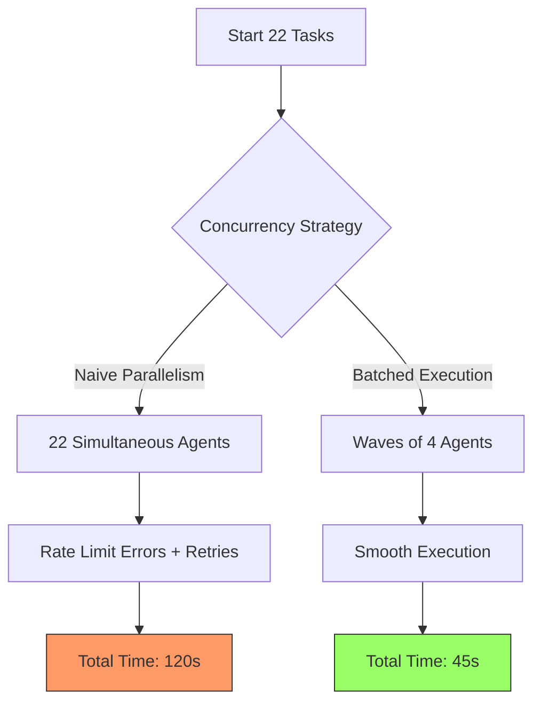

# The Concurrency Trap: Why 22 AI Agents are Slower Than 5

In the world of software engineering, our instinct is often to parallelize everything. If one task takes 10 seconds, surely 10 tasks in parallel should also take 10 seconds, right? When we started building complex AI agent workflows, we applied this same logic. We thought, "If we need to explore 22 different code paths, let's just spawn 22 background agents and get it done all at once."

The result was a sluggish, timeout-prone mess that was actually slower than running the tasks in smaller batches. This is the **Concurrency Trap** in AI orchestration.

## Why: The Hidden Costs of Parallelism

While modern CPUs and networks are great at handling many concurrent connections, AI agents introduce unique bottlenecks that traditional software doesn't always face.

### 1. Token Rate Limits
Most AI providers (OpenAI, Anthropic, etc.) enforce strict rate limits on tokens per minute (TPM) and requests per minute (RPM). When you spawn 22 agents simultaneously, they all compete for the same quota. This leads to "429 Too Many Requests" errors and aggressive retries, which actually increase total execution time.

### 2. Context Management Overhead
Managing the state, memory, and context of 22 active agents is computationally expensive for the orchestration layer. The overhead of context switching and coordination can quickly outweigh the benefits of parallelism.

### 3. Diminishing Returns (Amdahl's Law)
Amdahl's Law states that the speedup of a program using multiple processors is limited by the sequential fraction of the program. In AI workflows, there's often a significant sequential component—gathering initial context, synthesizing results, or waiting for a shared resource.

## How: Finding the Sweet Spot

Through rigorous testing in the `oh-my-opencode` environment, we observed a clear pattern:

-   **22 Parallel Agents**: Sluggish responsiveness, frequent timeouts, inconsistent completion times, and high failure rates due to rate limiting.
-   **3-5 Parallel Agents**: Highly responsive, reliable, predictable completion times, and almost zero rate-limit issues.

The "sweet spot" for most AI agent tasks seems to be between **3 and 5 concurrent tasks**.



## What: Implementing Batched Execution

To avoid the concurrency trap, we use a **Parallel Wave** execution pattern. Instead of launching everything at once, we process tasks in manageable "waves."

### Code Example: Batched Execution Pattern

```typescript
async function runInWaves<T>(tasks: (() => Promise<T>)[], batchSize: number = 4): Promise<T[]> {
  const results: T[] = [];
  
  for (let i = 0; i < tasks.length; i += batchSize) {
    const batch = tasks.slice(i, i + batchSize);
    console.log(`Executing wave ${Math.floor(i / batchSize) + 1}...`);
    
    const batchResults = await Promise.all(batch.map(task => task()));
    results.push(...batchResults);
  }
  
  return results;
}

// Usage
const explorationTasks = codePaths.map(path => () => explorePath(path));
const allResults = await runInWaves(explorationTasks, 4);
```

### Key Takeaways for Agent Orchestration

1.  **Respect the Rate Limits**: Design your system to stay well within your provider's TPM/RPM limits.
2.  **Prioritize Reliability**: A slightly slower, successful execution is always better than a fast, failed one.
3.  **Monitor Overhead**: Keep an eye on the memory and CPU usage of your orchestration layer as you scale concurrency.
4.  **Use Waves**: Implement batched execution to maintain a steady, predictable flow of work.

## Conclusion

In the race to build autonomous AI systems, speed is important, but stability is paramount. Don't fall into the trap of thinking that more agents always equals more speed. By right-sizing your concurrency and using patterns like Parallel Waves, you can build AI workflows that are both fast and rock-solid. Sometimes, to go fast, you have to slow down.
