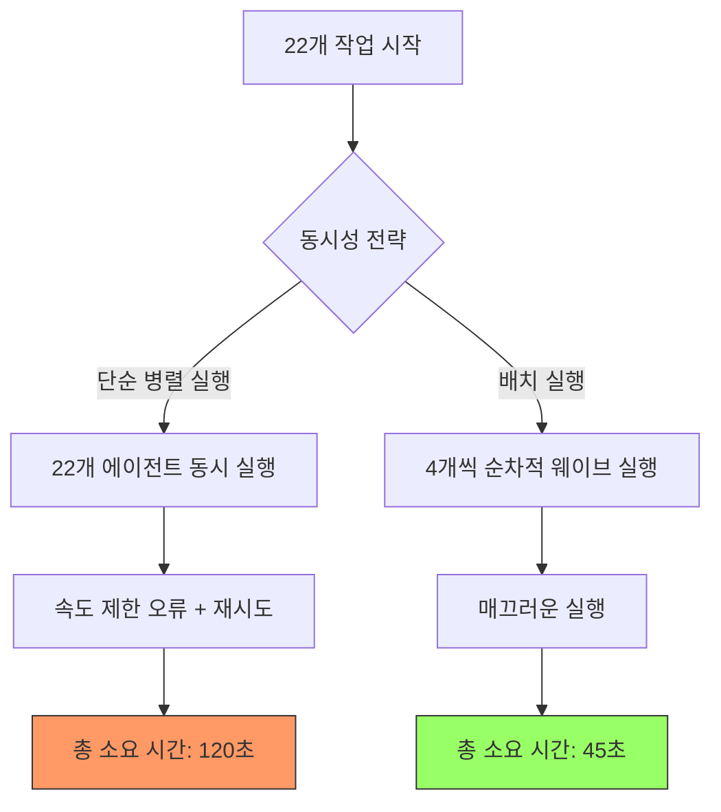

# 병렬성의 함정: 왜 22개의 AI 에이전트가 5개보다 느릴까?

소프트웨어 엔지니어링의 세계에서 우리의 본능은 모든 것을 병렬화하는 것입니다. 하나의 작업에 10초가 걸린다면, 10개의 작업을 동시에 실행해도 똑같이 10초가 걸려야 한다고 생각하죠. 복잡한 AI 에이전트 워크플로우를 구축하기 시작했을 때도 우리는 똑같은 논리를 적용했습니다. "22개의 서로 다른 코드 경로를 탐색해야 한다면, 22개의 백그라운드 에이전트를 한꺼번에 띄워서 처리하자!"라고 말이죠.

결과는 처참했습니다. 시스템은 느려졌고, 타임아웃이 빈번하게 발생했으며, 실제로는 작업을 작은 단위로 나누어 실행할 때보다 더 오랜 시간이 걸렸습니다. 이것이 바로 AI 오케스트레이션에서의 **병렬성의 함정(Concurrency Trap)**입니다.

## Why: 병렬 실행의 숨겨진 비용

현대의 CPU와 네트워크는 수많은 동시 연결을 처리하는 데 능숙하지만, AI 에이전트는 전통적인 소프트웨어가 직면하지 않는 독특한 병목 현상을 일으킵니다.

### 1. 토큰 속도 제한 (Token Rate Limits)
대부분의 AI 서비스 제공업체(OpenAI, Anthropic 등)는 분당 토큰 수(TPM)와 분당 요청 수(RPM)에 대해 엄격한 제한을 둡니다. 22개의 에이전트를 동시에 실행하면, 이들은 모두 동일한 할당량을 두고 경쟁하게 됩니다. 이는 "429 Too Many Requests" 오류와 공격적인 재시도(Retry)로 이어지며, 결과적으로 전체 실행 시간을 늘리게 됩니다.

### 2. 컨텍스트 관리 오버헤드
22개의 활성 에이전트의 상태, 메모리, 컨텍스트를 관리하는 것은 오케스트레이션 계층에 상당한 계산 비용을 발생시킵니다. 컨텍스트 스위칭과 조정(Coordination)에 드는 비용이 병렬화로 얻는 이득을 빠르게 상쇄해 버립니다.

### 3. 수확 체감의 법칙 (암달의 법칙)
암달의 법칙(Amdahl's Law)에 따르면, 프로그램의 실행 속도 향상은 프로그램 내의 순차적인 부분에 의해 제한됩니다. AI 워크플로우에는 초기 컨텍스트 수집, 결과 종합, 혹은 공유 자원 대기와 같은 상당한 순차적 요소가 포함되어 있는 경우가 많습니다.

## How: 최적의 지점 찾기

`oh-my-opencode` 환경에서 진행한 엄격한 테스트를 통해 우리는 명확한 패턴을 발견했습니다:

-   **22개 병렬 에이전트**: 응답성이 떨어지고, 타임아웃이 잦으며, 완료 시간이 불규칙합니다. 속도 제한으로 인한 실패율이 높습니다.
-   **3~5개 병렬 에이전트**: 응답성이 뛰어나고 신뢰할 수 있으며, 완료 시간을 예측할 수 있습니다. 속도 제한 문제가 거의 발생하지 않습니다.

대부분의 AI 에이전트 작업에서 "최적의 지점(Sweet Spot)"은 **동시 작업 3~5개** 사이인 것으로 나타났습니다.



## What: 배치 실행(Batched Execution) 구현

병렬성의 함정을 피하기 위해 우리는 **병렬 웨이브(Parallel Wave)** 실행 패턴을 사용합니다. 모든 작업을 한꺼번에 쏟아붓는 대신, 관리 가능한 "웨이브" 단위로 작업을 처리하는 방식입니다.

### 코드 예시: 배치 실행 패턴

```typescript
async function runInWaves<T>(tasks: (() => Promise<T>)[], batchSize: number = 4): Promise<T[]> {
  const results: T[] = [];
  
  for (let i = 0; i < tasks.length; i += batchSize) {
    const batch = tasks.slice(i, i + batchSize);
    console.log(`${Math.floor(i / batchSize) + 1}번째 웨이브 실행 중...`);
    
    const batchResults = await Promise.all(batch.map(task => task()));
    results.push(...batchResults);
  }
  
  return results;
}

// 사용 예시
const explorationTasks = codePaths.map(path => () => explorePath(path));
const allResults = await runInWaves(explorationTasks, 4);
```

### 에이전트 오케스트레이션을 위한 핵심 팁

1.  **속도 제한을 존중하십시오**: 제공업체의 TPM/RPM 제한 내에서 여유 있게 작동하도록 시스템을 설계하십시오.
2.  **신뢰성을 우선하십시오**: 조금 느리더라도 성공하는 것이, 빠르지만 실패하는 것보다 항상 낫습니다.
3.  **오버헤드를 모니터링하십시오**: 동시성을 높일 때 오케스트레이션 계층의 메모리와 CPU 사용량을 주시하십시오.
4.  **웨이브를 활용하십시오**: 배치 실행을 통해 일정하고 예측 가능한 작업 흐름을 유지하십시오.

## 결론

자율형 AI 시스템을 구축하는 경쟁에서 속도도 중요하지만, 안정성이 최우선입니다. 에이전트 수가 많을수록 항상 속도가 빨라질 것이라는 착각에 빠지지 마십시오. 동시성 규모를 적절히 조절하고 병렬 웨이브와 같은 패턴을 활용함으로써, 빠르면서도 견고한 AI 워크플로우를 구축할 수 있습니다. 때로는 더 빨리 가기 위해 속도를 줄여야 할 때가 있습니다.
