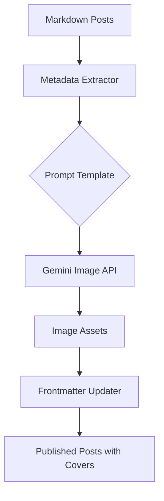

## WHY: The Bottleneck of Visual Consistency

In the world of technical blogging, content is king, but presentation is the crown. A high-quality cover image not only makes a post more clickable on social media but also establishes a professional brand identity. However, for a developer-writer, creating these visuals is often a significant bottleneck.

Recently, I found myself with 29 new blog posts, all lacking cover images. Manually designing 29 unique, topically-relevant visuals would have taken hours, if not days. I needed a way to maintain visual consistency and topical relevance without sacrificing my writing time. The goal was simple: **Automate the visual identity of my blog.**

## HOW: A Systematic AI Workflow

To solve this, I moved away from manual design and towards a "Prompt Engineering as a Service" workflow. Instead of thinking about pixels, I thought about metadata.

The strategy involved three key steps:
1. **Content Analysis**: Extracting the core essence of each post from its title and summary.
2. **Prompt Orchestration**: Creating a standardized prompt template that ensures visual consistency while allowing for topical variation.
3. **Batch Execution**: Leveraging the Gemini Image Generation API via Model Context Protocol (MCP) to generate images in parallel.

### The Architecture of Automation



By treating image generation as a data pipeline, I could ensure that every post received a high-quality, minimalist visual that matched the blog's aesthetic.

## WHAT: Implementation Details

The actual implementation was surprisingly lean. I used a custom MCP tool, `mcp-image_generate_image`, to interface with Gemini.

### 1. The Prompt Template
Consistency is achieved through a strict prompt structure. I used a "Minimalist Tech" style:
> "Minimalist, high-tech abstract cover for a blog post titled: '<topic>'. Use a dark theme with neon accents, clean lines, and a professional aesthetic. No text in the image."

### 2. Batch Generation Script
I processed the posts in batches of 10 to stay within API limits and monitor quality.

```bash
# Example of the generation command
mcp-image_generate_image(
  prompt="Minimalist cover for: Batch AI Cover Image Generation",
  fileName="2026-02-04-batch-ai-cover-image-generation.png"
)
```

### 3. Automating the Frontmatter
Once the images were generated and moved to the `/static/covers/` directory, I updated the markdown files.

```yaml
# Before
lang: en

# After
lang: en
cover:
  image: "/covers/2026-02-04-batch-ai-cover-image-generation.png"
```

## Results and Reflection

The results were transformative:
- **Speed**: 29 unique images generated in approximately 3 minutes.
- **Scale**: 58 files (EN + KO versions) updated automatically.
- **Consistency**: Every post now shares a unified visual language.

By applying an engineering mindset to a creative task, I eliminated a major friction point in my publishing workflow. AI didn't just replace the designer; it empowered the writer to be a publisher.

---

## What's Next?
In the next post, I'll dive into how I handle the economics of these AI calls using a cascading model fallback system. Stay tuned!
