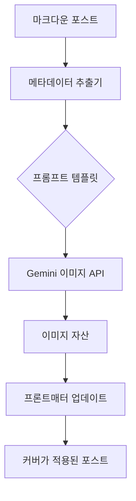

## WHY: 시각적 일관성의 병목 현상

기술 블로그의 세계에서 콘텐츠가 왕이라면, 디자인은 그 왕관과 같습니다. 고품질의 커버 이미지는 소셜 미디어에서 클릭률을 높일 뿐만 아니라, 블로그의 전문적인 브랜드 아이덴티티를 구축하는 데 필수적입니다. 하지만 개발자이자 작가인 우리에게 이러한 비주얼을 만드는 작업은 종종 큰 병목 현상이 되곤 합니다.

최근 저는 커버 이미지가 없는 29개의 새로운 블로그 포스트를 마주하게 되었습니다. 각 포스트의 주제에 맞는 29개의 고유한 이미지를 수동으로 디자인하는 것은 몇 시간, 아니 며칠이 걸릴 수도 있는 작업이었습니다. 저는 글쓰기 시간을 희생하지 않으면서도 시각적 일관성과 주제의 연관성을 유지할 수 있는 방법이 필요했습니다. 목표는 간단했습니다. **블로그의 시각적 정체성을 자동화하는 것**이었습니다.

## HOW: 체계적인 AI 워크플로우

이 문제를 해결하기 위해 저는 수동 디자인에서 벗어나 "서비스로서의 프롬프트 엔지니어링(Prompt Engineering as a Service)" 워크플로우로 전환했습니다. 픽셀 단위로 고민하는 대신, 메타데이터 단위로 생각하기 시작했습니다.

전략은 크게 세 단계로 구성되었습니다:
1. **콘텐츠 분석**: 각 포스트의 제목과 요약에서 핵심 정수를 추출합니다.
2. **프롬프트 오케스트레이션**: 시각적 일관성을 보장하면서도 주제별 변주가 가능한 표준화된 프롬프트 템플릿을 제작합니다.
3. **배치 실행**: Model Context Protocol(MCP)을 통해 Gemini 이미지 생성 API를 활용하여 이미지를 병렬로 생성합니다.

### 자동화 아키텍처



이미지 생성을 데이터 파이프라인으로 취급함으로써, 모든 포스트에 블로그의 미학적 기준에 부합하는 고품질의 미니멀한 비주얼을 부여할 수 있었습니다.

## WHAT: 구현 세부 사항

실제 구현은 놀라울 정도로 간결했습니다. 저는 Gemini와 인터페이스하기 위해 커스텀 MCP 도구인 `mcp-image_generate_image`를 사용했습니다.

### 1. 프롬프트 템플릿
일관성은 엄격한 프롬프트 구조를 통해 달성됩니다. 저는 "미니멀 테크(Minimalist Tech)" 스타일을 적용했습니다:
> "'<topic>'이라는 제목의 블로그 포스트를 위한 미니멀하고 하이테크한 추상 커버 이미지. 네온 액센트가 있는 어두운 테마, 깔끔한 선, 전문적인 미학을 사용하세요. 이미지에 텍스트는 포함하지 마세요."

### 2. 배치 생성 스크립트
API 제한을 준수하고 품질을 모니터링하기 위해 10개 단위로 배치를 나누어 처리했습니다.

```bash
# 생성 명령 예시
mcp-image_generate_image(
  prompt="Minimalist cover for: Batch AI Cover Image Generation",
  fileName="2026-02-04-batch-ai-cover-image-generation.png"
)
```

### 3. 프론트매터 자동 업데이트
이미지가 생성되어 `/static/covers/` 디렉토리로 이동된 후, 마크다운 파일을 업데이트했습니다.

```yaml
# 수정 전
lang: ko

# 수정 후
lang: ko
cover:
  image: "/covers/2026-02-04-batch-ai-cover-image-generation.png"
```

## 결과 및 회고

결과는 혁신적이었습니다:
- **속도**: 약 3분 만에 29개의 고유 이미지 생성 완료.
- **규모**: 58개의 파일(EN + KO 버전) 자동 업데이트.
- **일관성**: 모든 포스트가 이제 통일된 시각적 언어를 공유합니다.

창의적인 작업에 엔지니어링 사고방식을 적용함으로써, 퍼블리싱 워크플로우의 주요 마찰 지점을 제거할 수 있었습니다. AI는 단순히 디자이너를 대체한 것이 아니라, 작가가 스스로 퍼블리셔가 될 수 있도록 힘을 실어주었습니다.

---

## 다음 단계는?
다음 포스트에서는 계층적 모델 폴백(Cascading Model Fallback) 시스템을 사용하여 이러한 AI 호출 비용을 어떻게 효율적으로 관리하는지 자세히 다루겠습니다. 기대해 주세요!
