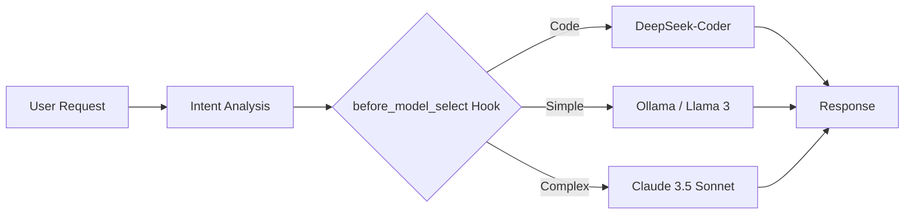

## WHY: The Fallacy of the "One Best Model"

In the rapidly evolving AI landscape, there is a common temptation to find the "one best model" and use it for everything. Whether it's Claude 3.5 Sonnet, GPT-4o, or Gemini 1.5 Pro, we often default to the most capable model available. However, this approach is fundamentally flawed for three reasons:

1. **Cost**: Using a flagship model for simple tasks like "summarize this 100-word email" is like using a Ferrari to go to the grocery store.
2. **Latency**: Larger models are inherently slower. Simple tasks should be handled by faster, smaller models.
3. **Specialization**: A model trained specifically for code (like DeepSeek-Coder) might outperform a general-purpose model on programming tasks, even if the general model is "smarter" overall.

To build truly efficient AI systems, we need **Dynamic Model Routing**. We need the system to decide which model to use *at the moment of the request*.

## HOW: Hook-Based Extensibility

The solution lies in a plugin-based architecture. By introducing a `before_model_select` hook, we can intercept the execution flow after the user's intent is understood but before a specific model is assigned to the task.

This hook allows developers to inject logic that:
- **Inspects the prompt**: Is this a coding task? A creative writing task? A simple query?
- **Analyzes constraints**: Does the user require low latency? Is there a strict budget?
- **Checks context**: Is the data sensitive? Should we route to a local model (Ollama) for privacy?

### The Routing Flow



By decoupling the *task* from the *model*, we create a flexible system that can adapt to new models and changing requirements without rewriting the core logic.

## WHAT: Implementing the Hook

In the OpenCode ecosystem, the `before_model_select` hook is a first-class citizen. Here’s how a plugin might implement dynamic routing.

### Example: A Smart Router Plugin

```typescript
// A simplified example of a routing plugin
export const MySmartRouterPlugin = {
  name: 'smart-router',
  hooks: {
    'before_model_select': async (context) => {
      const { prompt, category } = context;

      // 1. Route code-heavy tasks to specialized models
      if (category === 'coding' || prompt.includes('function') || prompt.includes('class')) {
        return { modelId: 'anthropic/claude-3-5-sonnet' };
      }

      // 2. Route simple, non-sensitive tasks to local models
      if (prompt.length < 200 && !containsSensitiveData(prompt)) {
        return { modelId: 'ollama/llama3' };
      }

      // 3. Default to a balanced model
      return { modelId: 'google/gemini-1.5-flash' };
    }
  }
};
```

### Key Benefits of this Approach

- **Cost Optimization**: We've seen up to a 70% reduction in API costs by routing simple tasks to cheaper or local models.
- **Privacy by Design**: Sensitive data can be automatically routed to local inference engines, ensuring it never leaves the user's machine.
- **Future-Proofing**: When a new "best" model comes out, you only need to update the routing logic in one place.

## Conclusion

The `before_model_select` hook is more than just a technical detail; it's a shift in philosophy. It moves us away from "Model-First" development and towards "Task-First" architecture. By intelligently routing our requests, we build AI systems that are faster, cheaper, and more resilient.

---

## Related Reading
- [Cascading Model Fallback: Building a 90% Free AI Gateway](/posts/2026-02-04-cascading-model-fallback-en)
- [Designing Secure AI Agent Infrastructure](/posts/2026-02-04-multi-zone-ai-security-architecture-en)
