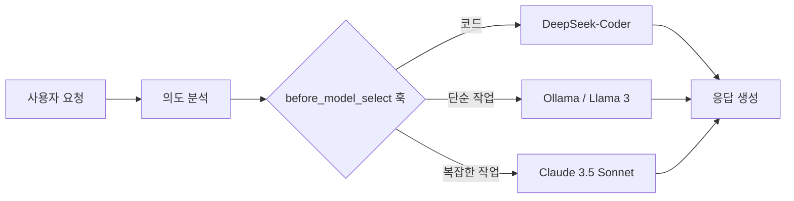

## WHY: '하나의 최고 모델'이라는 환상

급변하는 AI 환경에서 우리는 흔히 모든 작업에 '하나의 최고 모델'을 찾아 사용하려는 유혹에 빠집니다. Claude 3.5 Sonnet이든, GPT-4o든, Gemini 1.5 Pro든, 우리는 대개 가장 성능이 좋다고 알려진 모델을 기본값으로 설정합니다. 하지만 이러한 접근 방식은 다음 세 가지 이유로 인해 근본적인 한계가 있습니다:

1. **비용**: "이 100단어 이메일을 요약해줘"와 같은 간단한 작업에 플래그십 모델을 사용하는 것은 동네 슈퍼마켓에 가기 위해 페라리를 타는 것과 같습니다.
2. **지연 시간(Latency)**: 거대 모델은 태생적으로 느립니다. 간단한 작업은 더 빠르고 작은 모델이 처리해야 합니다.
3. **특화(Specialization)**: 특정 분야(예: 코드)에 특화된 모델(DeepSeek-Coder 등)은 전체적인 '지능'이 더 높은 범용 모델보다 해당 작업에서 더 뛰어난 성능을 보일 수 있습니다.

진정으로 효율적인 AI 시스템을 구축하려면 **동적 모델 라우팅(Dynamic Model Routing)**이 필요합니다. 즉, 시스템이 *요청이 들어오는 순간*에 어떤 모델을 사용할지 결정해야 합니다.

## HOW: 훅 기반의 확장성

해결책은 플러그인 기반 아키텍처에 있습니다. `before_model_select` 훅을 도입하면, 사용자의 의도는 파악되었지만 특정 모델이 할당되기 직전의 실행 흐름을 가로챌 수 있습니다.

이 훅을 통해 개발자는 다음과 같은 로직을 주입할 수 있습니다:
- **프롬프트 검사**: 이것이 코딩 작업인가? 창의적인 글쓰기인가? 아니면 단순한 질의인가?
- **제약 조건 분석**: 사용자가 낮은 지연 시간을 원하는가? 엄격한 예산 제한이 있는가?
- **컨텍스트 확인**: 데이터가 민감한가? 프라이버시를 위해 로컬 모델(Ollama)로 라우팅해야 하는가?

### 라우팅 흐름



*작업(Task)*과 *모델(Model)*을 분리함으로써, 핵심 로직을 수정하지 않고도 새로운 모델이나 변화하는 요구사항에 유연하게 대응할 수 있는 시스템을 만들 수 있습니다.

## WHAT: 훅 구현하기

OpenCode 생태계에서 `before_model_select` 훅은 핵심적인 기능을 담당합니다. 다음은 플러그인이 동적 라우팅을 구현하는 예시입니다.

### 예시: 스마트 라우터 플러그인

```typescript
// 단순화된 라우팅 플러그인 예시
export const MySmartRouterPlugin = {
  name: 'smart-router',
  hooks: {
    'before_model_select': async (context) => {
      const { prompt, category } = context;

      // 1. 코드 비중이 높은 작업은 특화 모델로 라우팅
      if (category === 'coding' || prompt.includes('function') || prompt.includes('class')) {
        return { modelId: 'anthropic/claude-3-5-sonnet' };
      }

      // 2. 단순하고 민감하지 않은 작업은 로컬 모델로 라우팅
      if (prompt.length < 200 && !containsSensitiveData(prompt)) {
        return { modelId: 'ollama/llama3' };
      }

      // 3. 기본값으로 균형 잡힌 모델 선택
      return { modelId: 'google/gemini-1.5-flash' };
    }
  }
};
```

### 이 접근 방식의 주요 이점

- **비용 최적화**: 단순한 작업을 저렴하거나 로컬 모델로 라우팅함으로써 API 비용을 최대 70%까지 절감할 수 있었습니다.
- **프라이버시 보호**: 민감한 데이터는 자동으로 로컬 추론 엔진으로 라우팅되어, 사용자 기기를 벗어나지 않도록 보장할 수 있습니다.
- **미래 대비**: 새로운 '최고의' 모델이 출시되어도 라우팅 로직 한 곳만 업데이트하면 됩니다.

## 결론

`before_model_select` 훅은 단순한 기술적 디테일 그 이상입니다. 이는 "모델 우선(Model-First)" 개발에서 "작업 우선(Task-First)" 아키텍처로의 철학적 전환을 의미합니다. 요청을 지능적으로 라우팅함으로써, 우리는 더 빠르고 저렴하며 탄력적인 AI 시스템을 구축할 수 있습니다.

---

## 관련 읽을거리
- [계층적 모델 폴백: 90% 무료 AI 게이트웨이 구축하기](/posts/2026-02-04-cascading-model-fallback-ko)
- [보안 AI 에이전트 인프라 설계하기](/posts/2026-02-04-multi-zone-ai-security-architecture-ko)
