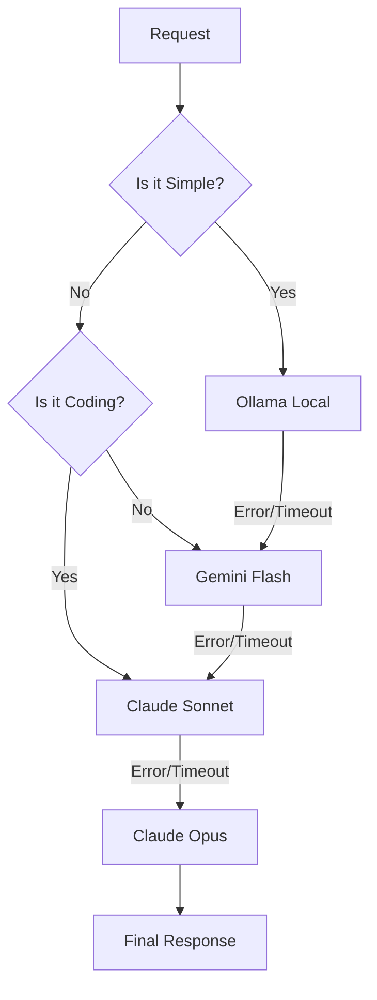

## WHY: The Hidden Tax of AI Adoption

As developers integrate AI into every corner of their workflow, a new reality is setting in: **API costs are the new cloud tax.** While a single request to Claude 3.5 Opus or GPT-4o might cost only a few cents, those cents add up quickly when you're running automated agents, code reviews, and background tasks.

The problem is that we often treat all AI requests as equal. We send a simple "fix this typo" request to the same $15/million token model that we use for "architect this entire microservice." This lack of nuance is costing us a fortune.

To make AI sustainable, we need a strategy that prioritizes **cost-efficiency without sacrificing reliability.** We need a system that uses the cheapest possible tool for the job, only escalating to premium models when absolutely necessary.

## HOW: The Cascading Fallback Architecture

The "Cascading Fallback" pattern is a local-first approach to AI orchestration. Instead of a single API endpoint, you implement a hierarchy of models. The system attempts to solve the task at the lowest (cheapest) level first, moving up the chain only if the task is too complex or the lower-level model fails.

### The Cascade Hierarchy

1. **Level 1: Local (Ollama)** - *Cost: $0*. Best for simple formatting, summarization, and non-sensitive data.
2. **Level 2: Cost-Effective Cloud (Kimi K2 / Gemini Flash)** - *Cost: Low*. Best for general reasoning and larger contexts.
3. **Level 3: Balanced Flagship (Claude Sonnet / GPT-4o)** - *Cost: Medium*. The workhorse for coding and complex logic.
4. **Level 4: Premium (Claude Opus / GPT-5)** - *Cost: High*. Reserved for critical, high-stakes reasoning where accuracy is paramount.

### The Logic Flow

This architecture ensures that the "expensive" models are only invoked when the "cheap" ones have proven insufficient.

## WHAT: Implementation and Results

In my own setup, I use a local-first gateway that manages this cascade automatically.

### 1. Routing Logic
The gateway analyzes the task category and complexity. If a task is categorized as "documentation" or "formatting," it defaults to a local Llama 3 model running on Ollama.

### 2. Graceful Degradation
If the local model returns an error (e.g., out of memory) or fails to follow a strict JSON schema, the system automatically retries the request with a slightly more capable cloud model like Gemini 1.5 Flash.

### 3. The Economic Impact
By implementing this cascade, the results have been staggering:
- **90% of requests** are handled by Level 1 (Local) or Level 2 (Cheap Cloud).
- **API costs dropped by ~85%** compared to a "Sonnet-only" approach.
- **Latency improved** for simple tasks, as local models often respond faster than cloud round-trips.

## Conclusion: AI Resilience

Cascading fallback isn't just about saving money; it's about **resilience**. By not being dependent on a single provider or a single model, your system becomes more robust. If Anthropic goes down, you fall back to Google. If your internet goes out, your local models keep the basic functionality alive.

In the age of AI, the smartest developers aren't the ones using the biggest models—they're the ones using the *right* models.

---

## Related Reading
- [Dynamic Model Routing: The Power of the before_model_select Hook](/posts/2026-02-04-before-model-select-hook-en)
- [Automating Blog Visuals with AI](/posts/2026-02-04-batch-ai-cover-image-generation-en)
