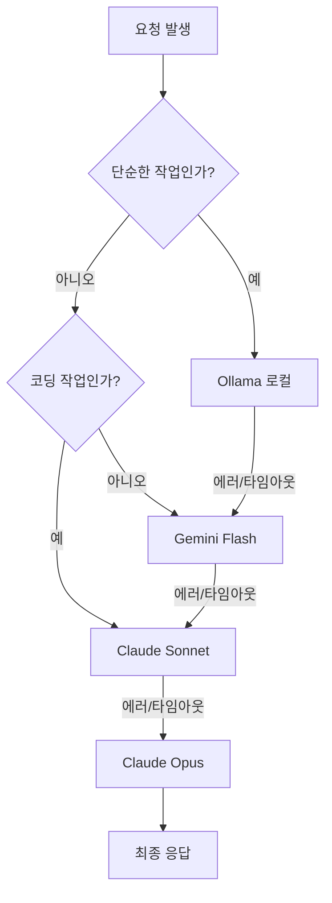

## WHY: AI 도입의 숨겨진 세금

개발자들이 워크플로우의 모든 구석에 AI를 통합함에 따라 새로운 현실이 다가오고 있습니다. 바로 **API 비용이 새로운 '클라우드 세금'이 되고 있다**는 점입니다. Claude 3.5 Opus나 GPT-4o에 보내는 단일 요청은 몇 센트에 불과할지 모르지만, 자동화된 에이전트, 코드 리뷰, 백그라운드 작업을 실행하다 보면 그 비용은 순식간에 불어납니다.

문제는 우리가 모든 AI 요청을 동일하게 취급한다는 점입니다. "이 오타 좀 고쳐줘"라는 간단한 요청을 "이 마이크로서비스 전체를 설계해줘"라고 할 때 사용하는 토큰당 수십 원짜리 모델에 그대로 보냅니다. 이러한 세밀함의 부족이 막대한 비용 낭비를 초래하고 있습니다.

AI 사용을 지속 가능하게 만들려면 **신뢰성을 희생하지 않으면서 비용 효율성을 우선시하는 전략**이 필요합니다. 즉, 가능한 한 가장 저렴한 도구를 사용하고, 정말 필요한 경우에만 프리미엄 모델로 격상시키는 시스템이 필요합니다.

## HOW: 계층적 폴백 아키텍처

"계층적 폴백(Cascading Fallback)" 패턴은 AI 오케스트레이션에 대한 로컬 우선(Local-First) 접근 방식입니다. 단일 API 엔드포인트를 사용하는 대신, 모델의 계층 구조를 구현합니다. 시스템은 먼저 가장 낮은(저렴한) 단계에서 작업을 해결하려고 시도하며, 작업이 너무 복잡하거나 하위 모델이 실패하는 경우에만 상위 단계로 이동합니다.

### 계층 구조 (The Cascade)

1. **1단계: 로컬 (Ollama)** - *비용: 0원*. 단순 포맷팅, 요약, 민감하지 않은 데이터 처리에 최적.
2. **2단계: 가성비 클라우드 (Kimi K2 / Gemini Flash)** - *비용: 매우 낮음*. 일반적인 추론 및 대량의 컨텍스트 처리에 적합.
3. **3단계: 균형 잡힌 플래그십 (Claude Sonnet / GPT-4o)** - *비용: 중간*. 코딩 및 복잡한 로직 처리를 위한 주력 모델.
4. **4단계: 프리미엄 (Claude Opus / GPT-5)** - *비용: 높음*. 정확도가 최우선인 중요한 의사결정 및 고난도 추론용.

### 로직 흐름

이 아키텍처는 "저렴한" 모델이 충분하지 않다고 판단될 때만 "비싼" 모델이 호출되도록 보장합니다.

## WHAT: 구현 및 결과

제 개인 환경에서는 이 계층 구조를 자동으로 관리하는 로컬 우선 게이트웨이를 사용합니다.

### 1. 라우팅 로직
게이트웨이는 작업의 카테고리와 복잡도를 분석합니다. 작업이 "문서화" 또는 "포맷팅"으로 분류되면, 기본적으로 Ollama에서 실행되는 로컬 Llama 3 모델을 할당합니다.

### 2. 우아한 성능 저하 (Graceful Degradation)
로컬 모델이 에러를 반환하거나(예: 메모리 부족), 엄격한 JSON 스키마를 따르지 못하는 경우, 시스템은 자동으로 Gemini 1.5 Flash와 같이 약간 더 성능이 좋은 클라우드 모델로 요청을 재시도합니다.

### 3. 경제적 효과
이 계층 구조를 도입한 결과는 놀라웠습니다:
- **전체 요청의 90%**가 1단계(로컬) 또는 2단계(가성비 클라우드)에서 처리되었습니다.
- **API 비용이 약 85% 절감**되었습니다 (Sonnet만 사용했을 때와 비교 시).
- **지연 시간 개선**: 단순 작업의 경우 클라우드 통신 없이 로컬에서 즉시 응답하므로 더 빠른 체감 속도를 제공합니다.

## 결론: AI 탄력성

계층적 폴백은 단순히 돈을 아끼는 것 이상의 의미가 있습니다. 바로 **탄력성(Resilience)**입니다. 특정 서비스 제공자나 모델에 의존하지 않음으로써 시스템은 더 견고해집니다. Anthropic 서버에 문제가 생기면 Google로 전환하고, 인터넷이 끊겨도 로컬 모델을 통해 기본적인 기능을 유지할 수 있습니다.

AI 시대에 가장 똑똑한 개발자는 가장 큰 모델을 쓰는 사람이 아니라, 상황에 맞는 **최적의 모델**을 쓰는 사람입니다.

---

## 관련 읽을거리
- [동적 모델 라우팅: before_model_select 훅의 활용](/posts/2026-02-04-before-model-select-hook-ko)
- [AI를 활용한 블로그 비주얼 자동화](/posts/2026-02-04-batch-ai-cover-image-generation-ko)
