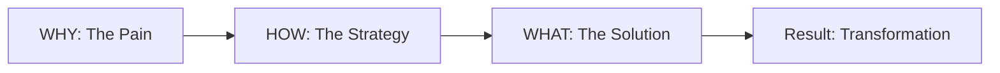

## WHY: The Documentation Trap

Most technical blog posts fall into what I call the "Documentation Trap." They read like a README file:
1. Here is the library I used.
2. Here is the code I wrote.
3. Here is how you run it.

While this information is useful, it's rarely *engaging*. As developers, we are trained to focus on the **WHAT**—the specific implementation details, the syntax, the tools. But as human beings, we are wired for stories. We don't just want to know *what* you built; we want to know *why* you bothered to build it in the first place.

When a blog post is purely WHAT-heavy, it lacks a narrative hook. Readers might skim the code, but they won't remember the lesson. To create content that resonates and sticks, we need to flip the script.

## HOW: Reframing with the Golden Circle

In his famous TED talk, Simon Sinek introduced the "Golden Circle"—a framework for leadership and communication that starts with **WHY**, then moves to **HOW**, and finally to **WHAT**.

Applying this to technical writing transforms a dry tutorial into a compelling narrative:

1. **WHY (The Emotional Hook)**: Start with the pain point. What was the problem that kept you up at night? Why did the existing solutions fail? This is where you connect with the reader's own frustrations.
2. **HOW (The Philosophy/Approach)**: Explain the principles you applied to solve the problem. This isn't about code yet; it's about your mental model, your architecture, and your decision-making process.
3. **WHAT (The Implementation)**: Finally, show the specific code, tools, and steps. Because the reader now understands the *why* and the *how*, the *what* becomes much more meaningful.

### The Narrative Arc

By following this arc, you aren't just teaching a skill; you're sharing a journey.

## WHAT: A Before and After Comparison

Let's look at how a typical post about "Setting up a Redis Cache" might be transformed.

### The "WHAT-First" Approach (Traditional)
> **Title: How to use Redis with Node.js**
> "In this post, I'll show you how to install Redis and use the `ioredis` library to cache API responses. First, run `npm install ioredis`..."

### The "WHY-First" Approach (Golden Circle)
> **Title: Why Your API is Slow (and How Redis Can Save It)**
> "**WHY**: Last week, our production server crashed because of a sudden spike in database queries. We realized that 80% of those queries were for the same static data. It was a waste of resources and a terrible user experience.
> **HOW**: We decided to implement a 'Cache-Aside' pattern. The goal wasn't just to add a database, but to create a layer of 'fast-access memory' that sits between our users and our expensive database operations.
> **WHAT**: Here is how we implemented the `ioredis` client to handle this..."

## Conclusion: Writing for Humans, Not Just Compilers

The Golden Circle structure works because it mirrors how the human brain processes information. We connect emotionally first (the limbic system), then we rationalize (the neocortex).

When you start with **WHY**, you give your readers a reason to care. When you explain the **HOW**, you give them a mental framework to understand. And when you finally show the **WHAT**, you give them the tools to take action.

Next time you sit down to write a technical post, don't start with the code. Start with the reason the code exists.

---

## Related Reading
- [Simon Sinek: Start With Why](https://www.ted.com/talks/simon_sinek_how_great_leaders_inspire_action)
- [Automating Blog Visuals with AI](/posts/2026-02-04-batch-ai-cover-image-generation-en)
