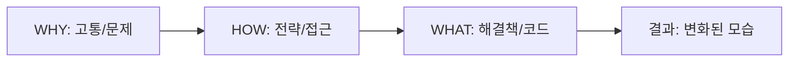

## WHY: '문서화'의 함정

대부분의 기술 블로그 포스트는 제가 "문서화의 함정(Documentation Trap)"이라고 부르는 것에 빠지곤 합니다. 마치 오픈소스의 README 파일을 읽는 것 같은 느낌을 주죠:
1. 내가 사용한 라이브러리는 이것입니다.
2. 내가 작성한 코드는 이것입니다.
3. 이렇게 실행하면 됩니다.

이러한 정보는 유용하지만, 독자를 **몰입**시키지는 못합니다. 개발자로서 우리는 **WHAT(무엇을)**—구체적인 구현 세부 사항, 문법, 도구—에 집중하도록 훈련받았습니다. 하지만 인간으로서 우리는 '이야기'에 끌리도록 설계되어 있습니다. 독자들은 당신이 *무엇을* 만들었는지뿐만 아니라, *왜* 그것을 만들었는지 알고 싶어 합니다.

블로그 포스트가 WHAT에만 치중되어 있으면 서사적인 갈고리(Narrative Hook)가 부족해집니다. 독자들은 코드를 훑어볼 수는 있지만, 그 안에 담긴 교훈을 기억하지는 못할 것입니다. 공감을 얻고 기억에 남는 콘텐츠를 만들려면 구성을 뒤집어야 합니다.

## HOW: 골든 서클로 재구성하기

사이먼 시넥(Simon Sinek)은 그의 유명한 TED 강연에서 "골든 서클(Golden Circle)"을 소개했습니다. 이는 **WHY(왜)**에서 시작하여 **HOW(어떻게)**를 거쳐 **WHAT(무엇을)**으로 나아가는 리더십과 커뮤니케이션의 프레임워크입니다.

이를 기술 글쓰기에 적용하면 딱딱한 튜토리얼을 매력적인 이야기로 바꿀 수 있습니다:

1. **WHY (정서적 연결)**: 고통 지점(Pain Point)에서 시작하세요. 밤잠을 설치게 했던 문제는 무엇이었나요? 기존의 해결책들이 왜 실패했나요? 여기서 독자의 고민과 연결됩니다.
2. **HOW (철학과 접근 방식)**: 문제를 해결하기 위해 적용한 원칙을 설명하세요. 아직 코드가 아닙니다. 당신의 사고 모델, 아키텍처, 그리고 의사결정 과정에 대한 이야기입니다.
3. **WHAT (구현)**: 마지막으로 구체적인 코드, 도구, 단계를 보여주세요. 독자가 이미 '왜'와 '어떻게'를 이해했기 때문에, '무엇을'은 훨씬 더 의미 있게 다가옵니다.

### 서사적 흐름

이 흐름을 따르면 단순히 기술을 가르치는 것이 아니라, 당신의 여정을 공유하게 됩니다.

## WHAT: 전과 후의 비교

"Redis 캐시 설정하기"라는 주제의 포스트가 어떻게 변할 수 있는지 살펴보겠습니다.

### "WHAT 우선" 접근 방식 (기존 방식)
> **제목: Node.js에서 Redis 사용하기**
> "이 포스트에서는 Redis를 설치하고 `ioredis` 라이브러리를 사용하여 API 응답을 캐싱하는 방법을 보여드리겠습니다. 먼저 `npm install ioredis`를 실행하세요..."

### "WHY 우선" 접근 방식 (골든 서클)
> **제목: 당신의 API가 느린 이유 (그리고 Redis가 이를 구원하는 방법)**
> "**WHY**: 지난주, 갑작스러운 데이터베이스 쿼리 급증으로 인해 운영 서버가 다운되었습니다. 확인 결과 쿼리의 80%가 동일한 정적 데이터를 요청하고 있었습니다. 이는 자원 낭비였고 사용자 경험에도 최악이었습니다.
> **HOW**: 우리는 '캐시 어사이드(Cache-Aside)' 패턴을 도입하기로 했습니다. 단순히 데이터베이스를 추가하는 것이 아니라, 사용자와 비용이 많이 드는 DB 작업 사이에 '고속 액세스 메모리' 계층을 만드는 것이 목표였습니다.
> **WHAT**: 이를 구현하기 위해 `ioredis` 클라이언트를 다음과 같이 설정했습니다..."

## 결론: 컴파일러가 아닌 인간을 위해 쓰기

골든 서클 구조가 효과적인 이유는 인간의 뇌가 정보를 처리하는 방식과 일치하기 때문입니다. 우리는 먼저 감정적으로 연결되고(변연계), 그 후에 이성적으로 판단합니다(대뇌 피질).

**WHY**로 시작하면 독자에게 글을 읽어야 할 이유를 제공합니다. **HOW**를 설명하면 이해를 위한 사고의 틀을 제공합니다. 그리고 마지막으로 **WHAT**을 보여주면 행동에 옮길 수 있는 도구를 제공하게 됩니다.

다음에 기술 포스트를 쓰기 위해 앉았을 때, 코드부터 시작하지 마세요. 그 코드가 존재해야만 하는 **이유**부터 시작해 보세요.

---

## 관련 읽을거리
- [사이먼 시넥: Start With Why (TED)](https://www.ted.com/talks/simon_sinek_how_great_leaders_inspire_action)
- [AI를 활용한 블로그 비주얼 자동화](/posts/2026-02-04-batch-ai-cover-image-generation-ko)
