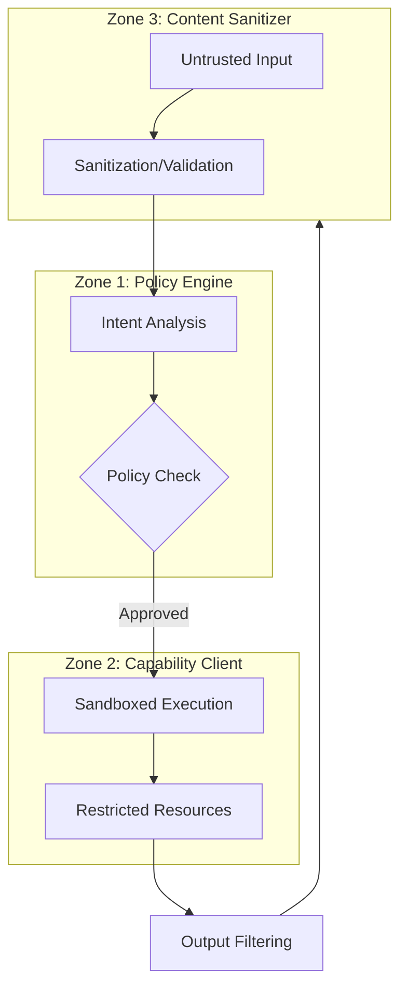

## WHY: The Autonomous Agent Dilemma

AI agents are the next frontier of productivity. Unlike simple chatbots, agents can *act*—they can write code, execute shell commands, access files, and interact with APIs. However, this autonomy introduces a massive security risk.

An AI agent is essentially a powerful engine with a potentially unreliable driver. If an agent is compromised via **Prompt Injection**, it could be tricked into deleting your database, leaking sensitive environment variables, or installing malware. Traditional security models, which assume a trusted user, are insufficient for autonomous systems that process untrusted input from the web.

To build safe AI agents, we must move away from "trust by default" and towards a **Multi-Zone Security Architecture**.

## HOW: Zone Separation and Defense in Depth

The core philosophy of this architecture is **Zone Separation**. By dividing the agent's responsibilities into three distinct security zones, we ensure that a failure in one zone does not lead to a total system compromise. This is the classic "Defense in Depth" principle applied to the AI era.

We isolate the **Brain** (Policy), the **Hands** (Capabilities), and the **Senses** (Input/Output).

### The 3-Zone Architecture

Each zone acts as a gatekeeper, ensuring that only safe and authorized operations are performed.

## WHAT: Deep Dive into the Zones

### Zone 1: The Policy Engine (The Brain)
This is the central nervous system of the agent. It doesn't execute code; it only makes decisions.
- **Approval Bot**: For dangerous operations (like `rm -rf` or `git push --force`), the Policy Engine requires explicit human approval.
- **Kill Switch**: An emergency stop that can immediately revoke all agent permissions.
- **Audit Logging**: Every intent and decision is logged with cryptographic integrity checks.

### Zone 2: The Capability Client (The Hands)
This is where the actual work happens. It must be strictly isolated.
- **Docker Sandboxing**: All code execution happens in a short-lived, isolated Docker container.
- **Resource Constraints**: Strict limits on CPU, memory, and network access.
- **Filesystem Jail**: The agent can only see and modify specific directories.

### Zone 3: The Content Sanitizer (The Senses)
This zone handles the interface between the agent and the outside world.
- **Injection Prevention**: Scans incoming prompts for known injection patterns.
- **Output Filtering**: Ensures the agent doesn't accidentally leak secrets (API keys, passwords) in its responses.
- **Input Validation**: Strictly enforces schemas for any data coming from external APIs.

## Conclusion: Security as an Enabler

Many developers view security as a hurdle that slows down innovation. In the world of AI agents, however, **security is an enabler**. Without a robust security architecture, you cannot give an agent the autonomy it needs to be truly useful.

By implementing a 3-zone architecture, you create a "Safe Sandbox" where AI can experiment, build, and automate without putting your entire infrastructure at risk.

---

## Related Reading
- [Cascading Model Fallback: Building a 90% Free AI Gateway](/posts/2026-02-04-cascading-model-fallback-en)
- [Dynamic Model Routing: The Power of the before_model_select Hook](/posts/2026-02-04-before-model-select-hook-en)
