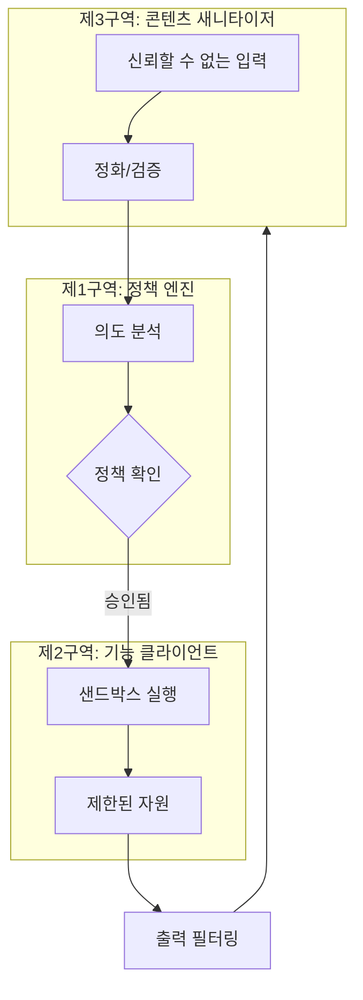

## WHY: 자율 에이전트의 딜레마

AI 에이전트는 생산성의 새로운 지평입니다. 단순한 챗봇과 달리 에이전트는 '행동'할 수 있습니다. 코드를 작성하고, 쉘 명령을 실행하며, 파일에 접근하고, API와 상호작용합니다. 하지만 이러한 자율성은 거대한 보안 리스크를 동반합니다.

AI 에이전트는 본질적으로 '신뢰할 수 없는 운전자가 탄 강력한 엔진'과 같습니다. 만약 에이전트가 **프롬프트 인젝션(Prompt Injection)**을 통해 침해당한다면, 데이터베이스를 삭제하거나, 민감한 환경 변수를 유출하거나, 악성코드를 설치하도록 속을 수 있습니다. 신뢰할 수 있는 사용자를 가정하는 기존의 보안 모델은 웹에서 신뢰할 수 없는 입력을 처리하는 자율 시스템에는 부적합합니다.

안전한 AI 에이전트를 구축하려면 '기본 신뢰'에서 벗어나 **다중 구역 보안 아키텍처(Multi-Zone Security Architecture)**로 전환해야 합니다.

## HOW: 구역 분리와 심층 방어

이 아키텍처의 핵심 철학은 **구역 분리(Zone Separation)**입니다. 에이전트의 책임을 세 개의 뚜렷한 보안 구역으로 나눔으로써, 한 구역의 실패가 전체 시스템의 침해로 이어지지 않도록 보장합니다. 이는 AI 시대에 적용된 고전적인 '심층 방어(Defense in Depth)' 원칙입니다.

우리는 에이전트의 **두뇌**(정책), **손**(기능), 그리고 **감각**(입출력)을 격리합니다.

### 3구역 보안 아키텍처

각 구역은 문지기 역할을 하며, 안전하고 승인된 작업만 수행되도록 보장합니다.

## WHAT: 각 구역별 상세 분석

### 제1구역: 정책 엔진 (두뇌)
에이전트의 중추 신경계입니다. 코드를 직접 실행하지 않고 의사결정만 내립니다.
- **승인 봇**: 위험한 작업(`rm -rf` 또는 `git push --force` 등)에 대해서는 명시적인 인간의 승인을 요구합니다.
- **킬 스위치(Kill Switch)**: 비상시 에이전트의 모든 권한을 즉시 회수할 수 있는 비상 정지 장치입니다.
- **감사 로그**: 모든 의도와 결정은 암호학적 무결성 검사와 함께 기록됩니다.

### 제2구역: 기능 클라이언트 (손)
실제 작업이 이루어지는 곳입니다. 엄격하게 격리되어야 합니다.
- **Docker 샌드박싱**: 모든 코드 실행은 수명이 짧고 격리된 Docker 컨테이너 내에서 발생합니다.
- **자원 제약**: CPU, 메모리, 네트워크 접근에 대한 엄격한 제한을 둡니다.
- **파일시스템 감옥(Jail)**: 에이전트는 특정 디렉토리만 보고 수정할 수 있습니다.

### 제3구역: 콘텐츠 새니타이저 (감각)
에이전트와 외부 세계 사이의 인터페이스를 담당합니다.
- **인젝션 방지**: 들어오는 프롬프트에서 알려진 인젝션 패턴을 스캔합니다.
- **출력 필터링**: 에이전트가 응답 중에 실수로 비밀 정보(API 키, 비밀번호 등)를 유출하지 않도록 보장합니다.
- **입력 검증**: 외부 API에서 오는 모든 데이터에 대해 엄격한 스키마를 적용합니다.

## 결론: 조력자로서의 보안

많은 개발자가 보안을 혁신을 늦추는 장애물로 여깁니다. 하지만 AI 에이전트의 세계에서 **보안은 조력자(Enabler)**입니다. 견고한 보안 아키텍처 없이는 에이전트가 진정으로 유용해지는 데 필요한 자율성을 부여할 수 없기 때문입니다.

3구역 아키텍처를 구현함으로써, 전체 인프라를 위험에 빠뜨리지 않으면서도 AI가 실험하고, 구축하고, 자동화할 수 있는 '안전한 놀이터'를 만들 수 있습니다.

---

## 관련 읽을거리
- [계층적 모델 폴백: 90% 무료 AI 게이트웨이 구축하기](/posts/2026-02-04-cascading-model-fallback-ko)
- [동적 모델 라우팅: before_model_select 훅의 활용](/posts/2026-02-04-before-model-select-hook-ko)
