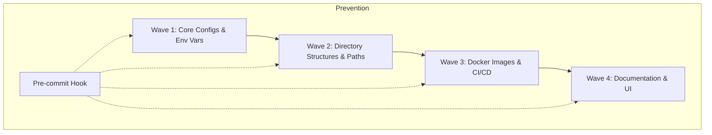

## Why: The Hidden Cost of Naming Chaos

In the fast-paced world of software development, naming often takes a backseat to functionality. We start with a project name like `moltbot`, then pivot to `clawdbot`, and finally settle on `openclaw`. However, the code rarely catches up. Legacy names linger in configuration files, Docker images, environment variables, and directory paths.

This inconsistency isn't just an aesthetic issue; it's a significant source of technical debt. It creates:
- **Cognitive Load**: Developers must remember that `CLAWDBOT_TOKEN` actually refers to the `openclaw` gateway.
- **Configuration Hell**: Mismatched environment variables lead to runtime failures that are difficult to debug.
- **Onboarding Friction**: New team members struggle to understand the relationship between disparate terms.

As one frustrated developer put it: *"You never have united terms... making it fucking hard to config or setup."* To solve this, we need more than just a "find and replace" session. We need a systematic migration and a way to ensure the old names never return.

## How: The Systematic Migration Strategy

A successful naming migration requires a structured approach to avoid breaking the system. We broke the process down into four distinct phases.

### 1. Systematic Audit
Before changing a single line of code, you must identify every occurrence of the legacy names. Using tools like `grep` or `ast-grep`, we mapped out 31 references across 13 different files, including hidden configs and CI/CD pipelines.

### 2. Wave-Based Execution
Migration shouldn't happen all at once. We organized the changes into "waves" based on dependencies.



### 3. Backward Compatibility
To prevent immediate breakage, especially in production environments, we used symlinks and environment variable aliasing. This allowed the system to recognize both old and new paths during the transition period.

### 4. The Prevention Hook
The most critical step is ensuring the debt doesn't crawl back. We implemented a pre-commit hook that scans staged changes for banned legacy terms and rejects the commit if any are found.

## What: Implementation Details

### The Migration Script
A simple bash script can handle the bulk of the renaming, but it must be idempotent and safe.

```bash
#!/bin/bash
# migrate-naming.sh

OLD_NAME="clawdbot"
NEW_NAME="openclaw"

# Rename files and directories
find . -name "*${OLD_NAME}*" -exec rename "s/${OLD_NAME}/${NEW_NAME}/" {} +

# Replace content
grep -rl "${OLD_NAME}" . | xargs sed -i "s/${OLD_NAME}/${NEW_NAME}/g"

# Create backward compatibility symlinks
ln -s ./config/openclaw.yaml ./config/clawdbot.yaml
```

### The Pre-commit Hook
We used `pre-commit` framework to enforce the new naming standard.

```yaml
# .pre-commit-config.yaml
repos:
-   repo: local
    hooks:
    -   id: forbid-legacy-names
        name: Forbid Legacy Names
        entry: grep -Ei "moltbot|clawdbot"
        language: system
        files: \.(ts|js|py|yaml|yml|json|md|sh|dockerfile)$
        exclude: ^migration-scripts/
        description: "Prevent legacy names from re-entering the codebase."
```

### Environment Variable Aliasing
In your application code, you can support both variables temporarily:

```typescript
const GATEWAY_TOKEN = process.env.OPENCLAW_GATEWAY_TOKEN || process.env.CLAWDBOT_GATEWAY_TOKEN;

if (!process.env.OPENCLAW_GATEWAY_TOKEN && process.env.CLAWDBOT_GATEWAY_TOKEN) {
  console.warn("Deprecation Warning: CLAWDBOT_GATEWAY_TOKEN is deprecated. Use OPENCLAW_GATEWAY_TOKEN instead.");
}
```

## Conclusion

Naming unification is more than just a cleanup task; it's about building a reliable and maintainable system. By combining a systematic audit with automated enforcement via pre-commit hooks, you can eradicate naming-related technical debt and ensure your codebase remains clean and consistent for the long haul.
