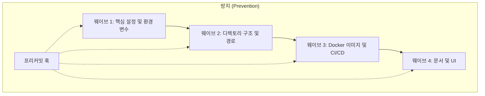

## Why: 네이밍 혼돈이 초래하는 숨겨진 비용

빠르게 변화하는 소프트웨어 개발 환경에서 네이밍은 종종 기능 구현에 밀려 뒷전이 되곤 합니다. 프로젝트 이름을 `moltbot`으로 시작했다가 `clawdbot`으로 바꾸고, 결국 `openclaw`로 확정하는 식이죠. 하지만 코드는 그 속도를 따라가지 못하는 경우가 많습니다. 레거시 이름들은 설정 파일, Docker 이미지, 환경 변수, 그리고 디렉토리 경로 곳곳에 유령처럼 남아있게 됩니다.

이러한 불일치는 단순히 미관상의 문제가 아닙니다. 이는 심각한 기술 부채의 원인이 됩니다:
- **인지 부하 (Cognitive Load)**: 개발자는 `CLAWDBOT_TOKEN`이 실제로는 `openclaw` 게이트웨이를 가리킨다는 사실을 매번 기억해야 합니다.
- **설정 지옥 (Configuration Hell)**: 일치하지 않는 환경 변수 이름은 디버깅하기 어려운 런타임 오류를 발생시킵니다.
- **온보딩 마찰**: 새로운 팀원은 서로 다른 용어들 사이의 관계를 이해하는 데 어려움을 겪습니다.

한 개발자의 불만 섞인 목소리처럼, *"용어가 통일되지 않으면... 설정이나 셋업이 정말 거지 같아집니다."* 이를 해결하기 위해서는 단순한 "찾아 바꾸기" 이상의 것이 필요합니다. 체계적인 마이그레이션 전략과 레거시 이름이 다시는 돌아오지 못하게 하는 방어 기제가 필요합니다.

## How: 체계적인 마이그레이션 전략

성공적인 네이밍 마이그레이션은 시스템을 망가뜨리지 않기 위해 구조적인 접근이 필요합니다. 우리는 이 과정을 네 가지 단계로 나누었습니다.

### 1. 체계적인 감사 (Audit)
코드 한 줄을 바꾸기 전에, 레거시 이름이 사용된 모든 곳을 찾아내야 합니다. `grep`이나 `ast-grep` 같은 도구를 사용하여 숨겨진 설정 파일과 CI/CD 파이프라인을 포함한 13개 파일에서 31개의 참조를 찾아냈습니다.

### 2. 웨이브 기반 실행 (Wave-based Execution)
마이그레이션은 한꺼번에 일어나서는 안 됩니다. 의존성에 따라 변경 사항을 "웨이브" 단위로 조직화했습니다.



### 3. 하위 호환성 유지
특히 운영 환경에서 즉각적인 장애가 발생하는 것을 막기 위해 심볼릭 링크(symlink)와 환경 변수 별칭(aliasing)을 사용했습니다. 이를 통해 전환 기간 동안 시스템이 이전 경로와 새로운 경로를 모두 인식할 수 있도록 했습니다.

### 4. 방지 훅 (Prevention Hook)
가장 중요한 단계는 부채가 다시 기어들어 오지 못하게 하는 것입니다. 스테이징된 변경 사항에서 금지된 레거시 용어를 스캔하고, 발견될 경우 커밋을 거부하는 프리커밋(pre-commit) 훅을 구현했습니다.

## What: 구현 세부 사항

### 마이그레이션 스크립트
단순한 bash 스크립트로 대량의 이름을 바꿀 수 있지만, 멱등성(idempotent)이 있고 안전해야 합니다.

```bash
#!/bin/bash
# migrate-naming.sh

OLD_NAME="clawdbot"
NEW_NAME="openclaw"

# 파일 및 디렉토리 이름 변경
find . -name "*${OLD_NAME}*" -exec rename "s/${OLD_NAME}/${NEW_NAME}/" {} +

# 내용 교체
grep -rl "${OLD_NAME}" . | xargs sed -i "s/${OLD_NAME}/${NEW_NAME}/g"

# 하위 호환성을 위한 심볼릭 링크 생성
ln -s ./config/openclaw.yaml ./config/clawdbot.yaml
```

### 프리커밋 훅 (Pre-commit Hook)
`pre-commit` 프레임워크를 사용하여 새로운 네이밍 표준을 강제했습니다.

```yaml
# .pre-commit-config.yaml
repos:
-   repo: local
    hooks:
    -   id: forbid-legacy-names
        name: Forbid Legacy Names
        entry: grep -Ei "moltbot|clawdbot"
        language: system
        files: \.(ts|js|py|yaml|yml|json|md|sh|dockerfile)$
        exclude: ^migration-scripts/
        description: "레거시 이름이 코드베이스에 다시 들어오는 것을 방지합니다."
```

### 환경 변수 별칭 처리
애플리케이션 코드에서 일시적으로 두 변수를 모두 지원할 수 있습니다.

```typescript
const GATEWAY_TOKEN = process.env.OPENCLAW_GATEWAY_TOKEN || process.env.CLAWDBOT_GATEWAY_TOKEN;

if (!process.env.OPENCLAW_GATEWAY_TOKEN && process.env.CLAWDBOT_GATEWAY_TOKEN) {
  console.warn("Deprecation Warning: CLAWDBOT_GATEWAY_TOKEN은 더 이상 사용되지 않습니다. OPENCLAW_GATEWAY_TOKEN을 사용하세요.");
}
```

## 결론

네이밍 통일은 단순한 정리 작업 그 이상입니다. 이는 신뢰할 수 있고 유지보수 가능한 시스템을 구축하는 과정입니다. 체계적인 감사와 프리커밋 훅을 통한 자동화된 강제 기법을 결합함으로써, 네이밍 관련 기술 부채를 완전히 제거하고 코드베이스를 장기적으로 깨끗하고 일관되게 유지할 수 있습니다.
