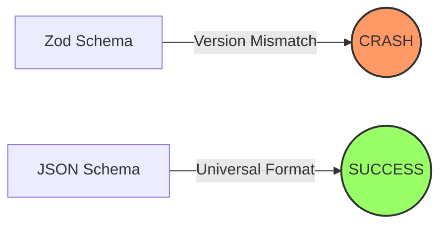

## Why: The Cryptic Crash of Custom Plugins

When extending OpenCode with custom plugins, developers often reach for familiar tools like [Zod](https://zod.dev/) to define tool schemas. It’s intuitive, type-safe, and widely used. However, this convenience can lead to a frustrating "Zod Version Trap."

Imagine you've built a perfect plugin, but as soon as OpenCode tries to load it, you're met with a cryptic error:
`TypeError: schema._zod.def is undefined`

This happens because of a **version mismatch**. When your plugin imports Zod directly (`import { z } from "zod"`), it might be using a slightly different version than the one bundled within the OpenCode core. In the world of TypeScript and complex object structures, even a minor version difference can break internal property access, leading to runtime crashes that are notoriously hard to debug.

## How: From Zod to JSON Schema

The solution isn't to find the "perfect" matching version of Zod—that's a maintenance nightmare. Instead, the "How" involves moving away from runtime-dependent schema objects to a universal, static format: **JSON Schema**.

By defining your tool parameters using standard JSON Schema objects, you eliminate the dependency on a specific Zod instance. OpenCode can then parse these static definitions reliably, regardless of what version of Zod (or any other library) it uses internally.

### The Migration Path



1. **Identify** the Zod-based tool definitions in your plugin.
2. **Translate** the Zod logic into a JSON Schema object structure.
3. **Replace** the `args` or `schema` property with a `parameters` object.

## What: Implementation Comparison

Let's look at a real-world example from the `gemini-error-logger.ts` plugin.

### The Broken Approach (Zod)

This looks correct on the surface, but it's the source of the version mismatch error.

```typescript
import { z } from "zod";

export const plugin = {
  name: "error-logger",
  tools: {
    "gemini-error-status": {
      description: "Check Gemini API error status",
      // BROKEN: Direct Zod dependency
      args: {
        dummy: z.string().optional().describe("Unused parameter"),
      }
    }
  }
};
```

### The Working Approach (JSON Schema)

By switching to JSON Schema, we remove the Zod dependency entirely and ensure compatibility.

```typescript
export const plugin = {
  name: "error-logger",
  tools: {
    "gemini-error-status": {
      description: "Check Gemini API error status",
      // WORKING: Static JSON Schema definition
      parameters: {
        type: "object",
        properties: {
          dummy: { 
            type: "string",
            description: "Unused parameter"
          }
        },
        required: [],
      }
    }
  }
};
```

### Why JSON Schema Wins in Plugins

- **Zero Dependencies**: Your plugin doesn't need to bundle or peer-depend on Zod.
- **Interoperability**: JSON Schema is the "lingua franca" of LLM tool calling (used by OpenAI, Anthropic, and Google).
- **Stability**: Static objects don't break when the host environment updates its internal libraries.

## Conclusion

The "Zod Version Trap" is a classic example of how modern dependency management can bite you in a plugin architecture. While Zod is fantastic for application code, **JSON Schema is the superior choice for plugin interfaces**. By making this simple switch, you ensure your OpenCode plugins are robust, compatible, and ready for any environment.
