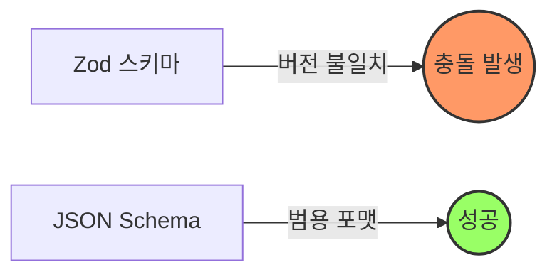

## Why: 커스텀 플러그인의 이유 없는 충돌

OpenCode의 기능을 확장하기 위해 커스텀 플러그인을 만들 때, 많은 개발자가 도구(tool)의 스키마를 정의하기 위해 [Zod](https://zod.dev/)를 선택합니다. 직관적이고, 타입 안전하며, 널리 사용되기 때문이죠. 하지만 이러한 편리함은 때때로 "Zod 버전의 함정"이라는 좌절스러운 상황으로 이어지곤 합니다.

완벽하게 작성했다고 생각한 플러그인이 OpenCode에 로드되는 순간, 다음과 같은 난해한 에러를 뱉으며 멈춰버리는 경우가 있습니다:
`TypeError: schema._zod.def is undefined`

이 에러의 원인은 바로 **버전 불일치(Version Mismatch)**입니다. 플러그인에서 Zod를 직접 임포트(`import { z } from "zod"`)하면, 해당 플러그인은 자신이 설치된 환경의 Zod 버전을 사용합니다. 만약 OpenCode 코어에 내장된 Zod 버전과 플러그인의 버전이 미세하게라도 다르면, 내부 속성에 접근하는 방식이 어긋나면서 런타임 에러가 발생하게 됩니다. TypeScript의 복잡한 객체 구조에서는 아주 작은 버전 차이도 치명적일 수 있습니다.

## How: Zod에서 JSON Schema로의 전환

해결책은 OpenCode와 완벽하게 일치하는 Zod 버전을 찾아 헤매는 것이 아닙니다. 그런 방식은 유지보수 측면에서 악몽과도 같습니다. 대신, 런타임 라이브러리에 의존하는 스키마 객체 대신 범용적이고 정적인 포맷인 **JSON Schema**를 사용하는 것이 정답입니다.

도구의 파라미터를 표준 JSON Schema 객체로 정의하면, 특정 Zod 인스턴스에 대한 의존성이 사라집니다. OpenCode는 내부적으로 어떤 버전의 Zod(또는 다른 라이브러리)를 사용하든 상관없이, 이 정적인 정의를 안정적으로 해석할 수 있게 됩니다.

### 마이그레이션 경로



1. 플러그인 내에서 Zod 기반으로 정의된 도구 설정을 **찾습니다**.
2. Zod 로직을 JSON Schema 객체 구조로 **변환합니다**.
3. `args` 또는 `schema` 속성을 `parameters` 객체로 **교체합니다**.

## What: 구현 비교

실제 `gemini-error-logger.ts` 플러그인의 사례를 통해 살펴보겠습니다.

### 문제가 되는 방식 (Zod 사용)

겉보기에는 아무 문제가 없어 보이지만, 버전 불일치 에러의 근원이 됩니다.

```typescript
import { z } from "zod";

export const plugin = {
  name: "error-logger",
  tools: {
    "gemini-error-status": {
      description: "Gemini API 에러 상태 확인",
      // 문제 발생: Zod에 직접적인 의존성 가짐
      args: {
        dummy: z.string().optional().describe("사용되지 않는 파라미터"),
      }
    }
  }
};
```

### 해결된 방식 (JSON Schema 사용)

JSON Schema로 전환하면 Zod 의존성이 완전히 제거되어 호환성이 보장됩니다.

```typescript
export const plugin = {
  name: "error-logger",
  tools: {
    "gemini-error-status": {
      description: "Gemini API 에러 상태 확인",
      // 해결: 정적인 JSON Schema 정의 사용
      parameters: {
        type: "object",
        properties: {
          dummy: { 
            type: "string",
            description: "사용되지 않는 파라미터"
          }
        },
        required: [],
      }
    }
  }
};
```

### 플러그인에서 JSON Schema가 더 좋은 이유

- **의존성 제로**: 플러그인이 Zod를 번들링하거나 `peerDependencies`에 포함할 필요가 없습니다.
- **상호 운용성**: JSON Schema는 OpenAI, Anthropic, Google 등 주요 LLM 도구 호출의 표준 언어입니다.
- **안정성**: 호스트 환경이 내부 라이브러리를 업데이트하더라도 정적 객체 정의는 깨지지 않습니다.

## 결론

"Zod 버전의 함정"은 플러그인 아키텍처에서 현대적인 의존성 관리가 어떻게 문제를 일으킬 수 있는지 보여주는 전형적인 사례입니다. 애플리케이션 코드에서는 Zod가 훌륭한 선택이지만, **플러그인 인터페이스에서는 JSON Schema가 훨씬 더 나은 선택**입니다. 이 간단한 전환만으로도 여러분의 OpenCode 플러그인을 어떤 환경에서도 동작하는 견고한 도구로 만들 수 있습니다.
