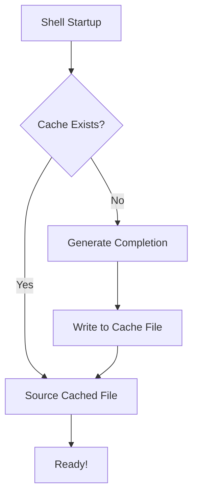

## Why: The Hidden Cost of Dynamic Completions

Every developer loves a fast terminal. We spend hours tweaking our prompts, aliases, and themes. Yet, many of us unknowingly tolerate a sluggish startup caused by a common pattern in CLI tool configuration.

The culprit? Dynamic completion generation. You've likely seen lines like this in your `.zshrc` or `.bashrc`:

```bash
eval "$(my-cool-tool completion zsh)"
```

While convenient, this command executes the CLI tool, generates the completion script, and evaluates it **every single time** you open a new terminal tab. If you have 10 tools doing this, and each takes 50ms, you've just added half a second of latency to your workflow. Over hundreds of terminal sessions a day, that's a lot of wasted time and unnecessary CPU cycles.

## How: From Dynamic Evaluation to Static Caching

The solution is simple: generate the completion script once and source the static file thereafter. We only need to regenerate the cache when the tool is installed or updated.

### The Caching Workflow



By moving the heavy lifting out of the critical path of shell startup, we achieve near-instantaneous terminal readiness.

## What: Implementation Strategies

### 1. Manual Caching (The Quick Fix)

Instead of `eval`, redirect the output to a file once:

```bash
# Run this once manually
my-cool-tool completion zsh > ~/.local/share/completions/_my-cool-tool

# In your .zshrc
source ~/.local/share/completions/_my-cool-tool
```

### 2. Automated Caching Script

You can add a small logic block to your shell configuration to handle this automatically and safely.

```bash
# completion-cache.sh
CACHE_DIR="${XDG_CACHE_HOME:-$HOME/.cache}/shell-completions"
mkdir -p "$CACHE_DIR"

cache_completion() {
    local tool=$1
    local shell_type=$2
    local cache_file="$CACHE_DIR/$tool.$shell_type"

    # Regenerate if file doesn't exist or is older than 1 week
    if [[ ! -f "$cache_file" || -n $(find "$cache_file" -mtime +7) ]]; then
        $tool completion "$shell_type" > "$cache_file" 2>/dev/null
    fi

    source "$cache_file"
}

# Usage in .zshrc
cache_completion "kubectl" "zsh"
cache_completion "gh" "zsh"
```

### 3. CLI Tool Best Practices (For Developers)

If you are building a CLI tool, don't just tell users to add `eval` to their RC files. Provide an `install-completions` command that handles the caching for them, or follow the XDG Base Directory Specification to place completions in standard locations like `/usr/local/share/zsh/site-functions`.

## Conclusion

Performance is a feature, even in your local development environment. By switching from dynamic `eval` to static completion caching, you can shave significant time off your shell startup. It’s a small change that makes your terminal feel significantly more responsive—and your future self will thank you for those saved milliseconds.
