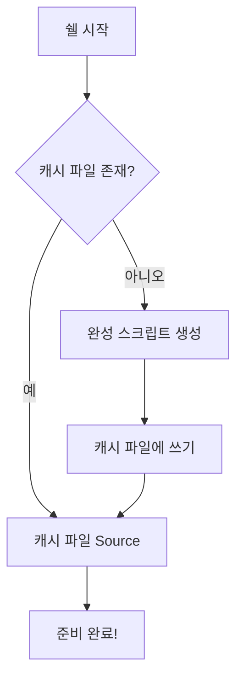

## Why: 동적 완성 스크립트의 숨겨진 비용

개발자라면 누구나 빠른 터미널을 원합니다. 우리는 프롬프트, 별칭(alias), 테마를 최적화하는 데 많은 시간을 투자하죠. 하지만 정작 많은 이들이 CLI 도구 설정으로 인해 발생하는 터미널 시작 지연을 무심코 넘기곤 합니다.

범인은 바로 '동적 완성 스크립트 생성'입니다. `.zshrc`나 `.bashrc` 파일에서 다음과 같은 코드를 본 적이 있을 겁니다:

```bash
eval "$(my-cool-tool completion zsh)"
```

이 방식은 편리하지만, 새로운 터미널 탭을 열 때마다 CLI 도구를 실행하고, 완성 스크립트를 생성하고, 이를 평가(eval)하는 과정을 **매번** 반복합니다. 이런 도구가 10개 있고 각각 50ms가 걸린다면, 터미널을 열 때마다 0.5초의 지연이 발생하게 됩니다. 하루에 수백 번 터미널을 여닫는 개발자에게 이는 결코 무시할 수 없는 시간 낭비이자 불필요한 CPU 소모입니다.

## How: 동적 평가에서 정적 캐싱으로

해결책은 간단합니다. 완성 스크립트를 한 번만 생성해서 파일로 저장하고, 이후에는 그 정적 파일을 불러오는(source) 것입니다. 도구가 설치되거나 업데이트될 때만 캐시를 갱신하면 됩니다.

### 캐싱 워크플로우



쉘 시작의 핵심 경로(critical path)에서 무거운 작업을 제거함으로써, 터미널을 즉시 사용할 수 있는 상태로 만들 수 있습니다.

## What: 구현 전략

### 1. 수동 캐싱 (빠른 해결책)

`eval` 대신, 한 번만 실행하여 결과를 파일로 저장하세요:

```bash
# 수동으로 한 번 실행
my-cool-tool completion zsh > ~/.local/share/completions/_my-cool-tool

# .zshrc 파일에 추가
source ~/.local/share/completions/_my-cool-tool
```

### 2. 자동 캐싱 스크립트

쉘 설정 파일에 자동화 로직을 추가하여 안전하게 관리할 수 있습니다.

```bash
# completion-cache.sh
CACHE_DIR="${XDG_CACHE_HOME:-$HOME/.cache}/shell-completions"
mkdir -p "$CACHE_DIR"

cache_completion() {
    local tool=$1
    local shell_type=$2
    local cache_file="$CACHE_DIR/$tool.$shell_type"

    # 파일이 없거나 생성된 지 7일이 지났으면 다시 생성
    if [[ ! -f "$cache_file" || -n $(find "$cache_file" -mtime +7) ]]; then
        $tool completion "$shell_type" > "$cache_file" 2>/dev/null
    fi

    source "$cache_file"
}

# .zshrc에서 사용
cache_completion "kubectl" "zsh"
cache_completion "gh" "zsh"
```

### 3. CLI 도구 개발자를 위한 팁

CLI 도구를 직접 만든다면, 사용자에게 단순히 `eval`을 추가하라고 안내하지 마세요. 캐싱을 처리해주는 `install-completions` 명령어를 제공하거나, XDG 기본 디렉토리 사양을 따라 `/usr/local/share/zsh/site-functions`와 같은 표준 위치에 완성 스크립트를 배치하는 것이 좋습니다.

## 결론

성공적인 개발 환경에서 성능은 곧 생산성입니다. 동적 `eval` 방식에서 정적 캐싱 방식으로 전환하는 것만으로도 쉘 시작 시간을 눈에 띄게 단축할 수 있습니다. 작은 변화지만 터미널의 반응 속도를 확실히 높여주며, 장기적으로 여러분의 소중한 시간을 아껴줄 것입니다.
