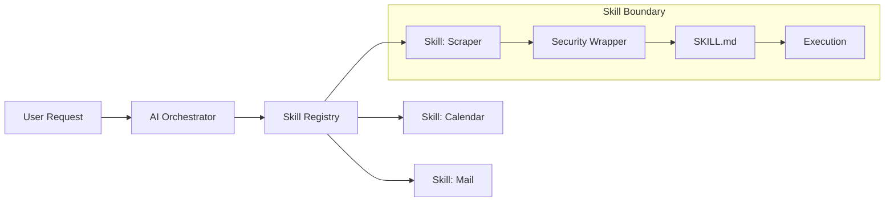

## Why: The Problem with Monolithic AI Agents

As we build more complex AI-driven automation, we often fall into the trap of creating "god-like" agents—single entities with access to every tool, script, and API in our system. While powerful, this approach leads to several critical issues:

1. **Security Risks**: An agent with broad access is a liability if it hallucinates or is manipulated.
2. **Context Overload**: Providing too many tools to an LLM increases noise and reduces the accuracy of tool selection.
3. **Maintenance Nightmares**: Updating one part of the system can inadvertently break unrelated functionalities.
4. **Poor Discoverability**: It becomes difficult for the AI (and the developer) to understand exactly what the system is capable of.

To solve this, we need a modular architecture that treats capabilities as discrete, documented, and secure units. We call this the **Skill-Based Automation Framework**.

## How: The Skill Pattern and SKILL.md

The core of this framework is the "Skill." A skill is a self-contained module that performs a specific set of tasks. By breaking down automation into 14+ specialized skills—ranging from `calendar-schedule` to `meme-collector`—we create clear boundaries and manageable components.

### The Anatomy of a Skill

Each skill follows a strict directory structure:

```text
skills/
└── web-scraper/
    ├── bin/            # Executable scripts
    ├── lib/            # Shared logic
    ├── config.yaml     # Skill-specific settings
    ├── security.ts     # Input validation & rate limiting
    └── SKILL.md        # AI-readable documentation
```

### SKILL.md: Documentation for AI

The most critical component is `SKILL.md`. Unlike traditional documentation meant for humans, `SKILL.md` is optimized for LLM consumption. It defines:
- **Purpose**: What the skill does in plain language.
- **Capabilities**: A list of specific actions the AI can take.
- **Constraints**: What the skill *cannot* or *should not* do.
- **Examples**: Few-shot prompts showing correct usage.

## What: Implementation and Architecture

### 1. Security Wrappers
Every skill is wrapped in a security layer. This layer validates inputs using schemas (like JSON Schema) and enforces rate limits to prevent runaway loops or API abuse.

```typescript
// security.ts example
export const validateInput = (input: any) => {
  const schema = {
    type: "object",
    properties: {
      url: { type: "string", format: "uri" },
      depth: { type: "number", maximum: 3 }
    },
    required: ["url"]
  };
  // Validation logic here...
};
```

### 2. The Skill Registry
A central registry loads skills based on the current task context. This ensures the AI only sees the tools relevant to its immediate goal, reducing context noise.



### 3. Diverse Automation Catalog
Our framework currently implements 14+ specialized skills, including:
- **daily-blog-gen**: Automates the content pipeline from seed to post.
- **daily-playlist**: Curates music based on the day's conversations.
- **newsletter-digest**: Summarizes hundreds of emails into a single report.
- **seed-to-blog**: The very pipeline used to generate this post!

## Conclusion

Moving from monolithic agents to a skill-based framework is a paradigm shift in AI engineering. By focusing on modularity, security, and AI-optimized documentation (SKILL.md), we create systems that are not only more powerful but also safer and easier to maintain. Whether you're building a personal assistant or an enterprise automation suite, the "Skill" pattern is the foundation for reliable AI operations.
