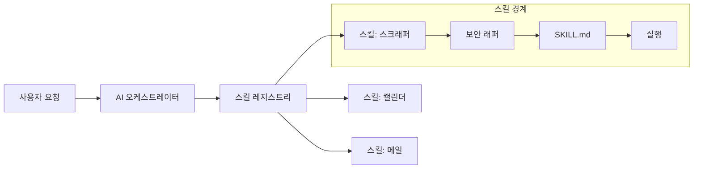

## Why: 거대 AI 에이전트의 함정

복잡한 AI 기반 자동화 시스템을 구축하다 보면, 모든 도구, 스크립트, API에 접근할 수 있는 단일한 '전지전능한' 에이전트를 만들고 싶은 유혹에 빠지기 쉽습니다. 하지만 이러한 접근 방식은 다음과 같은 심각한 문제를 야기합니다:

1. **보안 리스크**: 광범위한 권한을 가진 에이전트가 환각(Hallucination)을 일으키거나 조작될 경우 시스템 전체가 위험에 처합니다.
2. **컨텍스트 과부하**: LLM에게 너무 많은 도구를 제공하면 노이즈가 증가하고, 적절한 도구를 선택하는 정확도가 떨어집니다.
3. **유지보수의 어려움**: 시스템의 한 부분을 수정했을 때 전혀 상관없는 기능이 망가지는 부작용이 발생할 수 있습니다.
4. **낮은 발견 가능성**: AI와 개발자 모두 시스템이 정확히 어떤 일을 할 수 있는지 파악하기 어려워집니다.

이를 해결하기 위해 우리는 기능을 독립적이고, 문서화되어 있으며, 보안이 보장된 단위로 취급하는 모듈형 아키텍처가 필요합니다. 우리는 이를 **스킬 기반 자동화 프레임워크(Skill-Based Automation Framework)**라고 부릅니다.

## How: 스킬 패턴과 SKILL.md

이 프레임워크의 핵심은 '스킬(Skill)'입니다. 스킬은 특정 작업을 수행하는 독립적인 모듈입니다. 자동화 기능을 `calendar-schedule`부터 `meme-collector`까지 14개 이상의 전문화된 스킬로 나눔으로써, 명확한 경계와 관리 가능한 컴포넌트를 생성합니다.

### 스킬의 구조

각 스킬은 엄격한 디렉토리 구조를 따릅니다:

```text
skills/
└── web-scraper/
    ├── bin/            # 실행 가능한 스크립트
    ├── lib/            # 공유 로직
    ├── config.yaml     # 스킬별 설정
    ├── security.ts     # 입력 검증 및 속도 제한
    └── SKILL.md        # AI가 읽을 수 있는 문서
```

### SKILL.md: AI를 위한 문서화

가장 중요한 컴포넌트는 `SKILL.md`입니다. 사람을 위한 기존 문서와 달리, `SKILL.md`는 LLM이 이해하기 최적화된 형태로 작성됩니다. 여기에는 다음 내용이 포함됩니다:
- **목적 (Purpose)**: 스킬이 하는 일을 평이한 언어로 설명합니다.
- **역량 (Capabilities)**: AI가 수행할 수 있는 구체적인 작업 목록입니다.
- **제약 사항 (Constraints)**: 스킬이 할 수 없거나 해서는 안 되는 일입니다.
- **예시 (Examples)**: 올바른 사용법을 보여주는 퓨샷(Few-shot) 프롬프트입니다.

## What: 구현 및 아키텍처

### 1. 보안 래퍼 (Security Wrappers)
모든 스킬은 보안 레이어로 감싸져 있습니다. 이 레이어는 JSON Schema 등을 사용하여 입력을 검증하고, 무한 루프나 API 남용을 방지하기 위해 속도 제한(Rate Limiting)을 강제합니다.

```typescript
// security.ts 예시
export const validateInput = (input: any) => {
  const schema = {
    type: "object",
    properties: {
      url: { type: "string", format: "uri" },
      depth: { type: "number", maximum: 3 }
    },
    required: ["url"]
  };
  // 검증 로직...
};
```

### 2. 스킬 레지스트리 (Skill Registry)
중앙 레지스트리는 현재 작업 컨텍스트에 따라 필요한 스킬만 로드합니다. 이를 통해 AI는 당면한 목표와 관련된 도구만 보게 되어 컨텍스트 노이즈를 줄일 수 있습니다.



### 3. 다양한 자동화 카탈로그
현재 우리 프레임워크는 다음과 같은 14개 이상의 전문 스킬을 구현하고 있습니다:
- **daily-blog-gen**: 씨앗(seed)에서 포스트까지의 콘텐츠 파이프라인을 자동화합니다.
- **daily-playlist**: 그날의 대화 내용을 바탕으로 음악을 큐레이션합니다.
- **newsletter-digest**: 수백 개의 이메일을 하나의 요약 보고서로 만듭니다.
- **seed-to-blog**: 바로 이 포스팅을 생성하는 데 사용된 파이프라인입니다!

## 결론

거대 에이전트에서 스킬 기반 프레임워크로 전환하는 것은 AI 엔지니어링의 패러다임 변화입니다. 모듈화, 보안, 그리고 AI 최적화 문서(SKILL.md)에 집중함으로써, 우리는 더 강력할 뿐만 아니라 더 안전하고 유지보수하기 쉬운 시스템을 만들 수 있습니다. 개인용 비서든 기업용 자동화 제품이든, '스킬' 패턴은 신뢰할 수 있는 AI 운영의 초석이 될 것입니다.
