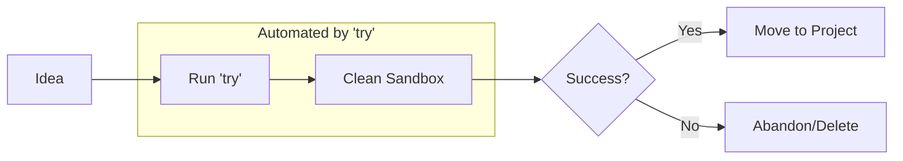

## Why: The Friction of Starting Small

We've all been there. You want to test a new library, reproduce a bug in isolation, or just play around with a snippet of code. But then the mental friction kicks in:
- *"Where should I put this folder?"*
- *"What should I name it?"*
- *"I'll just put it on the Desktop for now..."* (and it stays there for six months).

This micro-friction often prevents us from experimenting as much as we should. We end up polluting our main project directories with "temp" files or, worse, we don't experiment at all because the setup feels like too much work. To be a better developer, you need a way to fail fast and explore freely without the baggage of organization.

## How: The Timestamped Experiment Pattern

The solution is a dedicated "experiments" directory and a simple shell function to manage it. Instead of manually creating folders, we use a `try` command that handles the naming, timestamping, and navigation for us.

### The Experiment Lifecycle



By automating the "setup" phase, you reduce the cost of starting an experiment to zero.

## What: Implementation Details

Here is a robust implementation of the `try` function for your `.zshrc` or `.bashrc`.

### The Shell Function

```bash
# try.sh
function try() {
    local EXPERIMENTS_DIR="$HOME/experiments"
    local DATE=$(date +%Y-%m-%d)
    local NAME=${1:-"experiment"}
    local TARGET_DIR=""
    
    # Ensure experiments directory exists
    mkdir -p "$EXPERIMENTS_DIR"
    
    # Find a unique directory name
    local COUNTER=1
    while true; do
        local SUFFIX=$(printf "%03d" $COUNTER)
        TARGET_DIR="$EXPERIMENTS_DIR/${DATE}-${SUFFIX}-${NAME}"
        if [[ ! -d "$TARGET_DIR" ]]; then
            break
        fi
        ((COUNTER++))
    done
    
    # Create and enter the directory
    mkdir -p "$TARGET_DIR"
    cd "$TARGET_DIR"
    
    # Optional: Initialize a git repo for easy 'undo'
    git init -q
    
    echo "🧪 Experiment started in: $TARGET_DIR"
}
```

### How to Use It

1. **Quick exploration**: Just type `try`. It creates a folder like `~/experiments/2026-02-04-001-experiment/` and jumps you right in.
2. **Named experiment**: Type `try "new-api-test"`. It creates `~/experiments/2026-02-04-001-new-api-test/`.
3. **Multiple same-day tests**: The counter automatically increments (`001`, `002`, etc.), so you never have naming collisions.

### Why This Works

- **Zero Mental Overhead**: You don't have to think. You just "try."
- **Chronological History**: Your experiments are naturally sorted by date.
- **Easy Cleanup**: Since everything is in `~/experiments`, you can safely delete folders older than 30 days with a simple cron job or manual sweep.
- **Isolation**: No more "temp.js" files floating around your production code.

## Conclusion

The best developers are the ones who experiment the most. By lowering the barrier to entry for small explorations, the `try` command encourages a culture of curiosity and rapid prototyping. Add it to your shell today, and watch your "experiments" folder become a rich history of your learning journey.
