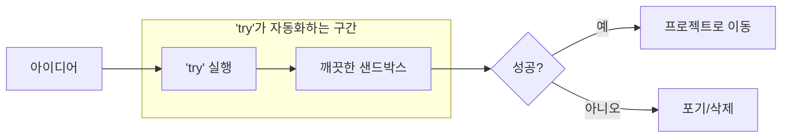

## Why: 시작을 가로막는 작은 마찰들

우리 모두 경험해본 일입니다. 새로운 라이브러리를 테스트하고 싶거나, 버그를 격리된 환경에서 재현해보고 싶을 때, 혹은 그냥 코드 한 조각을 실행해보고 싶을 때가 있죠. 하지만 그 순간 머릿속에는 작은 마찰들이 생겨납니다:
- *"이 폴더를 어디에 만들어야 하지?"*
- *"이름은 뭐라고 지을까?"*
- *"일단 바탕화면에 만들자..."* (그리고 그 폴더는 6개월 동안 그 자리에 남게 됩니다).

이러한 미세한 마찰은 우리가 더 많이 실험하고 배우는 것을 방해합니다. 결국 메인 프로젝트 디렉토리에 "temp" 파일들이 쌓이게 되거나, 셋업이 귀찮아서 실험 자체를 포기하게 되기도 하죠. 더 나은 개발자가 되기 위해서는 조직화에 대한 부담 없이 빠르게 실패하고 자유롭게 탐색할 수 있는 방법이 필요합니다.

## How: 타임스탬프 기반 실험 패턴

해결책은 전용 "experiments" 디렉토리를 만들고, 이를 관리하는 간단한 쉘 함수를 사용하는 것입니다. 폴더를 수동으로 만드는 대신, 네이밍, 타임스탬프 생성, 디렉토리 이동을 한 번에 처리해주는 `try` 명령어를 사용합니다.

### 실험의 라이프사이클



"셋업" 단계를 자동화함으로써, 실험을 시작하는 비용을 거의 제로(0)로 낮출 수 있습니다.

## What: 구현 세부 사항

여러분의 `.zshrc`나 `.bashrc`에 추가할 수 있는 견고한 `try` 함수 구현 예시입니다.

### 쉘 함수 구현

```bash
# try.sh
function try() {
    local EXPERIMENTS_DIR="$HOME/experiments"
    local DATE=$(date +%Y-%m-%d)
    local NAME=${1:-"experiment"}
    local TARGET_DIR=""
    
    # 실험용 디렉토리가 없으면 생성
    mkdir -p "$EXPERIMENTS_DIR"
    
    # 고유한 디렉토리 이름 찾기
    local COUNTER=1
    while true; do
        local SUFFIX=$(printf "%03d" $COUNTER)
        TARGET_DIR="$EXPERIMENTS_DIR/${DATE}-${SUFFIX}-${NAME}"
        if [[ ! -d "$TARGET_DIR" ]]; then
            break
        fi
        ((COUNTER++))
    done
    
    # 디렉토리 생성 및 이동
    mkdir -p "$TARGET_DIR"
    cd "$TARGET_DIR"
    
    # 선택 사항: 쉬운 '되돌리기'를 위해 git 초기화
    git init -q
    
    echo "🧪 실험이 시작되었습니다: $TARGET_DIR"
}
```

### 사용 방법

1. **빠른 탐색**: 그냥 `try`라고 입력하세요. `~/experiments/2026-02-04-001-experiment/`와 같은 폴더를 만들고 즉시 이동합니다.
2. **이름 지정 실험**: `try "new-api-test"`라고 입력하세요. `~/experiments/2026-02-04-001-new-api-test/`가 생성됩니다.
3. **같은 날 여러 번 테스트**: 카운터가 자동으로 증가(`001`, `002` 등)하므로 이름 충돌 걱정이 없습니다.

### 이 방식이 효과적인 이유

- **인지 부하 제로**: 생각할 필요가 없습니다. 그냥 "try" 하면 됩니다.
- **연대기적 기록**: 실험들이 날짜별로 자연스럽게 정렬됩니다.
- **쉬운 정리**: 모든 것이 `~/experiments`에 모여 있으므로, 30일 이상 된 폴더를 삭제하는 크론(cron) 작업이나 수동 정리가 매우 쉽습니다.
- **격리**: 운영 코드 주변에 "temp.js" 같은 파일들이 떠다니는 것을 방지합니다.

## 결론

훌륭한 개발자는 가장 많이 실험하는 개발자입니다. 작은 탐색을 시작하는 장벽을 낮춤으로써, `try` 명령어는 호기심과 빠른 프로토타이핑의 문화를 장려합니다. 오늘 바로 여러분의 쉘에 추가해보세요. "experiments" 폴더가 여러분의 학습 여정을 담은 풍부한 기록 저장소가 되는 것을 보게 될 것입니다.
